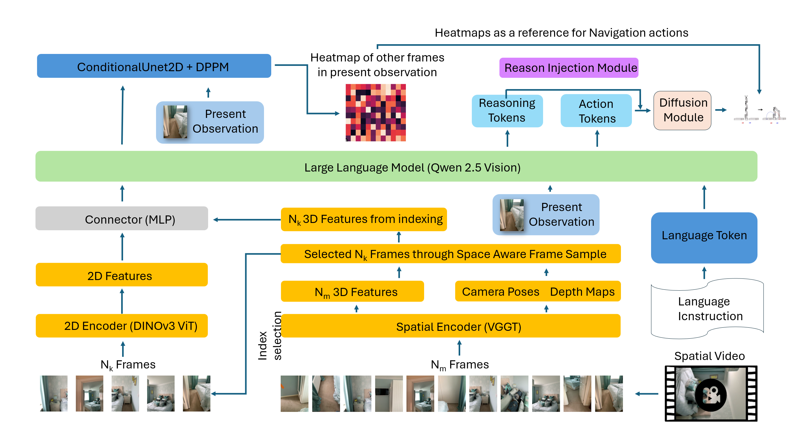

# HeatmapVLN

本目录实现了一个用于 **第一人称跨帧热力图（inter-frame heatmap）** 与 **动作预测** 的训练/评估/推理流水线。

以下是设计架构图：



*N帧照片构成的视频序列，与当前观测，动作指令一起输入LLM，LLM输出token通过重排生成二维向量，最终通过ConditionalUnet2D生成热力图。我们只要求模型在当前观测的Nk帧中能准确抓住空间关系以解决时间累计造成的数据量溢出的问题。最终我们希望生成的热力图能为导航提供重要的位置信息以供参考。*


当前仓库内真实可用的入口脚本为：

- `scripts/train.py`：训练（四阶段 curriculum，包含 history/future 热力图 + action + stop）
- `scripts/evaluate.py`：评估（支持 history/future/action，支持保存可视化）
- `scripts/inference.py`：推理（支持对视频或数据集 clip 运行并保存热力图/动作）


---

## 快速开始

### 1) 环境安装

建议在 `HeatmapVLN` 目录下安装依赖：

```bash
cd HeatmapVLN

# 建议 Python 3.11+（与本项目依赖/代码路径更匹配）
conda create -n models python=3.11 -y
conda activate models

pip install -U pip
pip install -r requirements.txt
```

如果你需要安装带 CUDA 的 PyTorch，请按你机器 CUDA 版本选择对应 wheel（`requirements.txt` 内也有注释提示）。

---


## 数据集加载逻辑（VLNSlidingWindowDataset）

### 核心思想：Clip-level 采样（推荐）

为解决滑动窗口采样导致的**样本高度相关性**问题（相邻帧生成的样本非常相似，容易过拟合），我们采用 **Clip-level 采样策略**：

**每个 epoch 从每个 clip 随机选择 N 个样本，而不是使用所有滑动窗口样本**

| 采样方式 | 样本数（假设1400 clips） | 样本相关性 | 每 epoch 变化 |
|---------|-------------------------|-----------|---------------|
| 滑动窗口(stride=1) | ~133,000 | 极高（>90%帧重叠） | 固定 |
| 滑动窗口(stride=5) | ~26,600 | 高（相邻帧相似） | 固定 |
| **Clip-level(N=2)** | ~2,800/epoch | **低** | **每 epoch 重新采样** |

**为什么 clip-level 采样有效？**
- 单 epoch 样本数虽少，但 50 epochs 累计可看到 ~140,000 个不同样本
- 每 epoch 从每个 clip 随机选择不同时刻，增加数据多样性
- 避免相邻帧高度相关导致的过拟合

### Clip-level 采样流程

```
Epoch 1:                          Epoch 2:
  Clip A → [STOP帧] + 随机选帧[12]    Clip A → [STOP帧] + 随机选帧[8]
  Clip B → [STOP帧] + 随机选帧[15]    Clip B → [STOP帧] + 随机选帧[23]
  ...                               ...（不同的随机组合）
```

**关键特性**：
- 每个 clip 的**最后一帧（STOP）始终被采样**，确保 STOP 样本不丢失
- 从非 STOP 帧中随机选择 `samples_per_clip - 1` 个样本
- 通过 `set_epoch()` 触发重新采样，每个 epoch 看到不同的样本组合
- 验证集使用固定滑动窗口采样（禁用 clip-level），确保指标可比

### 数据增强

训练集自动启用数据增强（仅影响图像，不影响热力图和动作标签）：

| 增强类型 | 参数 | 说明 |
|---------|------|------|
| **ColorJitter** | brightness=0.3, contrast=0.3, saturation=0.2, hue=0.1, p=0.5 | 颜色抖动，增加光照鲁棒性 |
| **GaussianNoise** | std=8.0, p=0.3 | 高斯噪声，增加噪声鲁棒性 |

### 关键参数

```python
VLNSlidingWindowDataset(
    root="/path/to/dataset",
    split="train",
    min_history=5,              # 最小历史帧数（T >= 5 才生成样本）
    num_history_sample=8,       # 从历史中采样的帧数 K
    image_size=(224, 224),      # 图像尺寸
    hm_size=(64, 64),           # 热力图尺寸
    sample_stride=5,            # 采样步长（滑动窗口模式使用）
    # Clip-level 采样配置（防止过拟合的关键）
    clip_level_sampling=True,   # 启用 clip-level 采样（推荐）
    samples_per_clip=2,         # 每个 clip 每 epoch 采样数（1 STOP + N-1 正常）
    enable_augmentation=True,   # 启用数据增强（仅训练集）
)
```

### 配置文件

```yaml
data:
  sliding_window:
    min_history: 5
    num_history_sample: 8
    sample_stride: 5            # 滑动窗口模式的步长
    # Clip-level 采样（解决样本高度相关性问题，防止过拟合）
    clip_level_sampling: true   # 启用（训练集自动使用，验证集自动禁用）
    samples_per_clip: 2         # 每 clip 每 epoch 采样 2 个样本（1 STOP + 1 正常）
```

### 采样数量估算

| 配置 | 单 epoch 样本数 | 50 epochs 累计 | 说明 |
|------|----------------|----------------|------|
| `samples_per_clip=2` | clips × 2 | clips × 100 | 推荐，平衡效率与覆盖 |
| `samples_per_clip=3` | clips × 3 | clips × 150 | 更多覆盖，略慢 |
| `samples_per_clip=1` | clips × 1 | clips × 50 | 最快，可能欠拟合 |

### 训练时调用

```python
# 每个 epoch 开始时调用，触发重新采样
train_loader.dataset.set_epoch(epoch)
```

### 返回格式

```python
{
    "history_frames": [K, 3, H, W],    # K 帧历史（均匀采样）
    "current_frame": [3, H, W],        # 当前观测
    "heatmap": [Hm, Wm],               # 历史位置热力图
    "action": [2],                     # 连续动作 (dx, dy)
    "action_valid": float,             # 是否有效（最后一帧=0）
    "discrete_action": int,            # 离散动作 (0=STOP, 1=FORWARD, 2=LEFT, 3=RIGHT)
    "is_stop": float,                  # 是否 STOP (0 or 1)
    "text": str,                       # 导航指令
}
```

### 热力图生成

热力图通过 **3D → 2D 投影 + 高斯模糊** 生成：

1. 读取历史帧和当前帧的 **相机位姿**（4×4 矩阵）
2. 将历史相机中心转换到当前相机坐标系
3. 投影到 Equirectangular 图像坐标
4. 绘制 **自适应高斯点**（距离越远，sigma 越小）
5. （可选）使用 **深度图** 进行遮挡检测

---

## 热力图生成模块（DiffusionHeatmapHead）

热力图生成模块使用 **条件扩散模型** 从 LLM 特征和视觉观测中生成空间热力图。

### 架构概览

```
┌─────────────────────────────────────────────────────────────────────────────┐
│                        DiffusionHeatmapHead 架构                            │
├─────────────────────────────────────────────────────────────────────────────┤
│                                                                             │
│  ┌─────────────┐    ┌─────────────┐                                         │
│  │ LLM Tokens  │    │  观测帧     │                                         │
│  │[B,seq,2048] │    │[B,3,H,W]    │                                         │
│  └──────┬──────┘    └──────┬──────┘                                         │
│         │                  │                                                │
│         ▼                  ▼                                                │
│  ┌─────────────┐    ┌─────────────┐                                         │
│  │  Mean Pool  │    │ CNN Encoder │  ← ImageConditionEncoder                │
│  └──────┬──────┘    │ (轻量级)    │    [32,64,128,256] 通道                 │
│         │           └──────┬──────┘                                         │
│         ▼                  │                                                │
│  ┌─────────────┐           │                                                │
│  │   Linear    │           │                                                │
│  │ Projection  │           │                                                │
│  └──────┬──────┘           │                                                │
│         │                  │                                                │
│         └───────┬──────────┘                                                │
│                 ▼                                                           │
│          ┌─────────────┐                                                    │
│          │ Concat + MLP│  ← MultiModalConditionEncoder                      │
│          │  (融合层)   │    输出 [B, cond_dim]                              │
│          └──────┬──────┘                                                    │
│                 │                                                           │
│     ┌───────────┴───────────┐                                               │
│     │                       │                                               │
│     ▼                       ▼                                               │
│ ┌────────┐           ┌─────────────┐                                        │
│ │条件向量│──────────▶│ConditionalU │                                        │
│ │[B,512] │  global   │   Net2D     │  ← FiLM 条件调制                       │
│ └────────┘   cond    │ (噪声预测)  │                                        │
│                      └──────┬──────┘                                        │
│                             │                                               │
│                 ┌───────────┴───────────┐                                   │
│                 │                       │                                   │
│                 ▼                       ▼                                   │
│          ┌─────────────┐         ┌─────────────┐                            │
│          │  Noisy HM   │  ←───── │ DDPM 10步   │                            │
│          │[B,1,Hm,Wm]  │  迭代   │  采样器     │                            │
│          └─────────────┘  去噪   └──────┬──────┘                            │
│                                         │                                   │
│                                         ▼                                   │
│                                  ┌─────────────┐                            │
│                                  │  Heatmap    │                            │
│                                  │ [B,Hm,Wm]   │                            │
│                                  └─────────────┘                            │
│                                                                             │
└─────────────────────────────────────────────────────────────────────────────┘
```

### 模块组件

#### 1. 条件编码器（MultiModalConditionEncoder）

负责融合文本和视觉信息：

| 组件 | 输入 | 输出 | 说明 |
|------|------|------|------|
| `LLMConditionProjector` | [B, seq, 2048] | [B, cond_dim] | Mean Pool → Linear → LayerNorm → GELU → Linear |
| `ImageConditionEncoder` | [B, 3, H, W] | [B, cond_dim] | 轻量级 CNN (Stem + 3 Stages + GAP + Projection) |
| `Fusion MLP` | [B, cond_dim×2] | [B, cond_dim] | Concat → Linear → LayerNorm → GELU → Linear |

**ImageConditionEncoder 架构**:
```python
Stem:     Conv 7×7 stride 2 → BatchNorm → ReLU → MaxPool
Stage 1:  ConvBlock(32→64, stride=2) + ResidualBlock(64)
Stage 2:  ConvBlock(64→128, stride=2) + ResidualBlock(128)
Stage 3:  ConvBlock(128→256, stride=2) + ResidualBlock(256)
Pool:     Global Average Pooling → [B, 256]
Project:  Linear(256, cond_dim) → LayerNorm → GELU → Linear
```

#### 2. 噪声预测网络（ConditionalUnet2D）

基于 2D U-Net 的条件去噪网络，使用 FiLM 调制：

| 参数 | 默认值 | 说明 |
|------|--------|------|
| `in_channels` | 1 | 输入通道（热力图单通道） |
| `out_channels` | 1 | 输出通道（预测噪声） |
| `block_out_channels` | (64, 128, 256) | 各层通道数 |
| `layers_per_block` | 2 | 每层残差块数量 |
| `attention_levels` | (2,) | 添加注意力的层级 |

**FiLM 条件调制**:
```
h = h × (1 + scale) + shift
```
其中 `scale, shift = MLP(timestep_emb + global_cond)`

#### 3. 扩散调度器（DDPMScheduler）

| 参数 | 默认值 | 说明 |
|------|--------|------|
| `num_train_timesteps` | 100 | 训练扩散步数 |
| `num_inference_steps` | 10 | 推理采样步数 |
| `beta_schedule` | `squaredcos_cap_v2` | 余弦噪声调度 |
| `prediction_type` | `epsilon` | 预测噪声（非直接预测样本） |

### 数据流

```
文本流: LLM Token [B,seq,2048] → Mean Pool → Linear → [B, cond_dim]
                                                          ↓
视觉流: 观测帧 [B,3,H,W] → CNN Encoder → [B, cond_dim] → Concat
                                                          ↓
条件流: [B, cond_dim×2] → Fusion MLP → [B, cond_dim] → ConditionalUnet2D
                                                          ↓
生成流: 随机噪声 [B,1,Hm,Wm] → 迭代去噪 (10步) → Heatmap [B,Hm,Wm]
```

### 训练与推理

**训练模式**:
```python
# 前向扩散：给 GT 热力图加噪
noisy_heatmap = scheduler.add_noise(gt_heatmap, noise, timesteps)

# 预测噪声
noise_pred = unet(noisy_heatmap, timesteps, global_cond)

# 计算 Loss
loss = F.mse_loss(noise_pred, noise)
```

**推理模式**:
```python
# 从纯噪声开始
noisy_heatmap = torch.randn(B, 1, Hm, Wm)

# 迭代去噪
for t in scheduler.timesteps:
    noise_pred = unet(noisy_heatmap, t, global_cond)
    noisy_heatmap = scheduler.step(noise_pred, t, noisy_heatmap).prev_sample

# 输出热力图
heatmap = denormalize(noisy_heatmap)  # [-1,1] → [0,1] → softmax
```

### 配置参数

在 `configs/train_config.yaml` 中：

```yaml
model:
  heatmap_head:
    enable_history: true        # 启用历史热力图头
    enable_future: true         # 启用未来热力图头
    cond_dim: 512               # 条件向量维度
    num_inference_steps: 10     # 推理扩散步数
```

### 源代码位置

| 文件 | 说明 |
|------|------|
| `src/models/heatmap/diffusion_heatmap_head.py` | 主模块：`DiffusionHeatmapHead` |
| `src/models/heatmap/diffusion/config.py` | 配置：`DiffusionHeatmapConfig` |
| `src/models/heatmap/diffusion/unet2d.py` | 噪声预测：`ConditionalUnet2D` |
| `src/models/heatmap/diffusion/image_encoder.py` | 条件编码：`MultiModalConditionEncoder` |

---

## 动作预测模块（DiffusionActionHead）

动作预测模块使用 **条件扩散模型** 从 LLM 特征中生成导航动作（2D 连续位移）。

### 架构概览

```
┌─────────────────────────────────────────────────────────────────────────────┐
│                       DiffusionActionHead 架构                              │
├─────────────────────────────────────────────────────────────────────────────┤
│                                                                             │
│  ┌─────────────┐                                                            │
│  │ LLM Tokens  │                                                            │
│  │ [B,seq,2048]│                                                            │
│  └──────┬──────┘                                                            │
│         │                                                                   │
│         ▼                                                                   │
│  ┌─────────────┐                                                            │
│  │  Mean Pool  │  ← ConditionProjector                                     │
│  │  [B, 2048]  │    Pool + Linear + LayerNorm + GELU + Linear              │
│  └──────┬──────┘                                                            │
│         │                                                                   │
│         ▼                                                                   │
│  ┌─────────────┐                                                            │
│  │ Projection  │                                                            │
│  │  [B, 256]   │  ← 条件向量（encoding_size=256，简化架构）                │
│  └──────┬──────┘                                                            │
│         │                                                                   │
│         └─────────────────────┐                                             │
│                               │                                             │
│                               ▼                                             │
│                        ┌─────────────┐                                      │
│                        │Conditional  │                                      │
│         ┌─────────────▶│   Unet1D    │  ← 1D 卷积 U-Net                     │
│         │              │(噪声预测)  │    down_dims=[128,256]               │
│         │              └──────┬──────┘                                      │
│         │                     │                                             │
│         │         ┌───────────┴───────────┐                                 │
│         │         │                       │                                 │
│         │         ▼                       ▼                                 │
│  ┌──────┴─────┐ ┌─────────────┐   ┌─────────────┐                          │
│  │条件向量    │ │ Noisy Action│   │ DDPM 10步   │                          │
│  │[B,256]    │ │ [B,1,2]     │◀──│  采样器     │                          │
│  └───────────┘ └─────────────┘   └──────┬──────┘                          │
│                   迭代去噪              │                                   │
│                                         ▼                                   │
│                                  ┌─────────────┐                            │
│                                  │  Actions    │                            │
│                                  │  [B,1,2]    │                            │
│                                  │ (归一化后)  │                            │
│                                  └──────┬──────┘                            │
│                                         │                                   │
│                                         ▼                                   │
│                                  ┌─────────────┐                            │
│                                  │Unnormalize  │                            │
│                                  │& Postprocess│                            │
│                                  └──────┬──────┘                            │
│                                         │                                   │
│                                         ▼                                   │
│                                  ┌─────────────┐                            │
│                                  │ Final Action│                            │
│                                  │   (dx, dy)  │                            │
│                                  └─────────────┘                            │
│                                                                             │
└─────────────────────────────────────────────────────────────────────────────┘
```

### 模块组件

#### 1. 条件投影器（ConditionProjector）

将 LLM 特征投影为扩散模型的条件向量：

| 组件 | 输入 | 输出 | 说明 |
|------|------|------|------|
| `Mean Pool` | [B, seq, 2048] | [B, 2048] | 时序维度平均池化 |
| `Projection` | [B, 2048] | [B, 256] | Linear → LayerNorm → GELU → Linear |

**架构简化**：相比 Heatmap Head，Action Head 使用更小的 encoding_size（256 vs 512），因为 2D 动作维度低，不需要过大的条件空间。

#### 2. 噪声预测网络（ConditionalUnet1D）

基于 1D U-Net 的条件去噪网络，专门处理低维时序数据：

| 参数 | 默认值 | 说明 |
|------|--------|------|
| `input_dim` | 2 | 输入维度（dx, dy） |
| `global_cond_dim` | 256 | 条件向量维度 |
| `down_dims` | [128, 256] | U-Net 通道数（简化架构） |
| `kernel_size` | 3 | 1D 卷积核大小 |
| `n_groups` | 8 | GroupNorm 分组数 |

**1D vs 2D**：Action 使用 1D 卷积处理序列数据 [B, pred_horizon, action_dim]，比 2D 卷积更高效。

#### 3. 动作归一化（ActionStats）

为确保扩散模型训练稳定，动作被归一化到 [-1, 1] 范围：

```python
# 归一化公式
normalized = (action - min_val) / (max_val - min_val) * 2.0 - 1.0

# 反归一化公式
action = (normalized + 1.0) / 2.0 * (max_val - min_val) + min_val
```

**默认统计值**（来自数据集统计）：
- `action_stats_min`: [-0.5, -0.2]（允许后退和左转）
- `action_stats_max`: [0.5, 1.0]（允许前进和右转）

#### 4. 扩散调度器（DDPMScheduler）

| 参数 | 默认值 | 说明 |
|------|--------|------|
| `num_train_timesteps` | 100 | 训练扩散步数 |
| `num_diffusion_iters` | 10 | 推理采样步数 |
| `beta_schedule` | `squaredcos_cap_v2` | 余弦噪声调度 |
| `prediction_type` | `epsilon` | 预测噪声（非直接预测动作） |

### 数据流

```
条件流: LLM Tokens [B,seq,2048] → Mean Pool → Projection → [B,256]
                                                              ↓
生成流: 随机噪声 [B,pred_horizon,2] → ConditionalUnet1D + 条件 → 迭代去噪
                                                              ↓
后处理: 归一化动作 [-1,1] → Unnormalize → 实际动作 (dx,dy)
```

### 训练与推理

**训练模式**：
```python
# 归一化 GT 动作到 [-1, 1]
normalized_gt = normalize_actions(gt_actions, action_stats)

# 前向扩散：给 GT 动作加噪
noisy_actions = scheduler.add_noise(normalized_gt, noise, timesteps)

# 预测噪声
noise_pred = unet(noisy_actions, timesteps, global_cond)

# 计算 Loss（带 action_valid mask）
per_sample_loss = F.mse_loss(noise_pred, noise, reduction='none')
if action_valid is not None:
    loss = (per_sample_loss * action_valid).sum() / action_valid.sum()
else:
    loss = per_sample_loss.mean()
```

**推理模式**：
```python
# 从纯噪声开始
noisy_actions = torch.randn(B, pred_horizon, action_dim)

# 迭代去噪
for t in scheduler.timesteps:
    noise_pred = unet(noisy_actions, t, global_cond)
    noisy_actions = scheduler.step(noise_pred, t, noisy_actions).prev_sample

# 反归一化得到实际动作
actions = unnormalize_actions(noisy_actions, action_stats)
```

**训练优化**：训练时 pipeline 跳过 action 推理，只返回条件向量 `action_cond`，由 `train.py` 外部计算 diffusion loss，避免冗余的 10 步扩散采样。

### Action Valid Mask

数据集中最后一帧的 `action_valid=0`（因为没有下一帧），训练时使用 mask 过滤这些样本：

```python
# Dataset 返回
action_valid = 1.0 if current_t < T - 1 else 0.0

# 训练时应用 mask
if action_valid.sum() > 0:
    loss = (per_sample_loss * action_valid).sum() / action_valid.sum()
else:
    loss = 0.0  # 无有效样本
```

### 配置参数

在 `configs/train_config.yaml` 中：

```yaml
model:
  action_head:
    enable: true                    # 启用动作预测
    action_dim: 2                   # 2D 动作 (dx, dy)
    pred_horizon: 1                 # 预测步数
    num_diffusion_iters: 10         # 扩散步数
    encoding_size: 256              # 条件维度（简化架构）
    down_dims: [128, 256]           # U-Net 通道数
    action_stats_min: [-0.5, -0.2]  # 归一化最小值
    action_stats_max: [0.5, 1.0]    # 归一化最大值

loss:
  action_weight: 0.5                # 动作损失权重
```

### Stop 预测头（StopPredictionHead）

Stop 预测是一个独立的二分类器，判断是否应该执行 STOP 动作：

**架构**：
```
LLM Tokens [B,seq,2048] → Mean Pool → MLP [2048→512→1] → Sigmoid → Stop Prob
```

**训练**：使用 Focal Loss 处理类别不平衡（STOP 样本稀少）：
```python
focal_loss = -alpha * (1 - pt)^gamma * log(pt)

# 默认参数
gamma = 2.0  # 越大越关注困难样本
alpha = 0.75 # STOP 类权重（因为极不平衡）
```

**数据来源**：
```python
# Dataset 从 discrete_actions 中提取
discrete_action = discrete_actions[current_t]  # 0=STOP, 1=FORWARD, 2=LEFT, 3=RIGHT
is_stop = 1.0 if discrete_action == 0 else 0.0
```

### 源代码位置

| 文件 | 说明 |
|------|------|
| `src/models/action/diffusion_action_head.py` | 主模块：`DiffusionActionHead` |
| `src/models/action/action_config.py` | 配置：`DiffusionActionConfig` |
| `src/models/action/diffusion/unet1d.py` | 噪声预测：`ConditionalUnet1D` |
| `src/models/action/utils.py` | 工具：`normalize_actions`, `ActionStats` |
| `src/models/action/stop_head.py` | Stop 预测：`StopPredictionHead` |

---

## 数据集准备

### 数据集结构

训练/评估使用 `VLNSlidingWindowDataset`，配置文件通过 `data.root` 指定数据集根目录：

- 默认：`configs/train_config.yaml` 中的 `data.root: dataset_with_actions`
- Split: 训练用 `train`，验证用 `data.val_split`（如 `val_unseen`）

### 目录结构（示例）

```text
<data.root>/
  train/
    <scene_id>/
      clip_000000/
        meta.json                     # 必需：包含 num_frames, instruction
        poses.json                    # 必需：T 个 4×4 位姿矩阵
        rgb/                          # 必需：RGB 图像序列
          000000.png
          000001.png
          ...
        depth/                        # 可选：深度图（用于遮挡检测）
          000000.npy
          000001.npy
          ...
        actions.npy                   # 可选：连续动作 [T, 2] (dx, dy)
        discrete_actions.npy          # 可选：离散动作 [T] (0-3)
        intrinsics.json               # 可选：相机内参
      clip_000001/
        ...
  val_unseen/
    <scene_id>/
      clip_000000/
        ...
```

### 必需/可选文件说明
```
| 文件 | 类型 | 说明 |
|------|------|------|
| `meta.json` | 必需 | 至少包含 `num_frames`（帧数）；可包含 `instruction`（导航指令） |
| `poses.json` | 必需 | 长度为 T 的 4×4 位姿矩阵列表 |
| `rgb/000000.png` | 必需 | 按 6 位零填充命名的 RGB 帧 |
| `depth/000000.npy` | 可选 | 用于遮挡检测；缺失时跳过遮挡判断 |
| `actions.npy` | 可选 | 连续动作 [T, 2] (dx, dy)；缺失时 `action_valid=0` |
| `discrete_actions.npy` | 可选 | 离散动作 [T] (STOP/FORWARD/LEFT/RIGHT)；缺失时 stop 标签默认非 stop |
| `intrinsics.json` | 可选 | 相机内参；缺失时使用默认全景图尺寸 (512, 256) |
```
**建议**：训练 action/stop head 时务必提供对应的动作文件。

---

## 推理（Inference）

> ⚠️ **运行前请确保激活 conda 环境**：
> ```bash
> conda activate models
> ```

推理脚本：`scripts/inference.py`  
支持两种输入：

- **视频文件**：`--video /path/to/video.mp4`
- **数据集 clip 目录**：`--clip <data.root>/<split>/<scene>/clip_xxxxxx`

如果你不传 `--use-history/--use-future/--use-actions`，脚本会默认全部输出。

### 对数据集 clip 推理（推荐）

```bash
cd HeatmapVLN

python scripts/inference.py \
  --clip dataset_with_actions/val_unseen/<scene_id>/clip_000000 \
  --config configs/train_config.yaml \
  --output-dir ./outputs_inference
```

### 对视频推理

```bash
cd HeatmapVLN

python scripts/inference.py \
  --video /path/to/video.mp4 \
  --instruction "从起点出发，沿走廊前进并找到目标" \
  --config configs/train_config.yaml \
  --output-dir ./outputs_inference
```

### 推理输出

默认会在 `--output-dir` 下生成：

- `*_history_heatmaps.png`（若启用 history）
- `*_future_heatmaps.png`（若启用 future）
- `*_actions.npy`（若启用 action）

---

## 训练（Training）

> ⚠️ **运行前请确保激活 conda 环境**：
> ```bash
> conda activate models
> ```

训练脚本：`scripts/train.py`  
默认读取：`--config configs/train_config.yaml`

### 一键按配置跑完整四阶段

```bash
cd HeatmapVLN

python scripts/train.py \
  --config configs/train_config.yaml
```

### 常用训练参数

- **从检查点恢复**

```bash
python scripts/train.py \
  --config configs/train_config.yaml \
  --resume /path/to/ckpt.pth
```

- **自动从最新检查点恢复**

```bash
python scripts/train.py \
  --config configs/train_config.yaml \
  --auto-resume
```

- **只跑某个阶段（按名称或索引）**

```bash
# 例：只跑 joint_128 阶段
python scripts/train.py \
  --config configs/train_config.yaml \
  --stage joint_128 \
  --stage-only
```

- **调试：只构建模型与数据，不实际训练**

```bash
python scripts/train.py \
  --config configs/train_config.yaml \
  --dry-run

# 快速测试训练流程（每 epoch 只跑 5 个 batch）
python scripts/train.py \
  --config configs/train_config.yaml \
  --max-batches 5 \
  --epochs 2
```

#### 5. 高级用法

```bash
# 从阶段 2 开始，一直训练到最后
python scripts/train.py \
  --config configs/train_config.yaml \
  --stage-index 1

# 跳过前 3 个 epoch，从第 4 个开始
python scripts/train.py \
  --config configs/train_config.yaml \
  --start-epoch 4 \
  --stage warmup_history_64 \
  --stage-only
```

**训练代码（后台运行）**
```bash
cd /root/VLN/Project && source /root/miniconda3/etc/profile.d/conda.sh && conda activate models && nohup python -u scripts/train.py --config configs/train_config.yaml --stage-index 0 --stage-only > train_stage1.log 2>&1 &

# 实时查看日志
tail -f train_stage1.log
```

> 💡 **提示**：`python -u` 禁用输出缓冲，确保日志实时写入文件。

### 训练配置说明

配置文件 `configs/train_config.yaml` 包含 **4 阶段渐进式训练**策略:

| 阶段 | 名称 | Epochs | 分辨率 | 训练目标 | Loss 类型 |
|------|------|--------|--------|----------|-----------|
| 0 | `warmup_history_64` | 5 | 64×64 | History Head + Action Head | Simplified |
| 1 | `warmup_future_64` | 5 | 64×64 | Future Head（冻结 History） | Simplified |
| 2 | `joint_128` | 10 | 128×128 | 双 Head 联合训练 | NeRF Ripple |
| 3 | `full_224` | 20 | 224×224 | 完整训练 + 解冻 Projector | NeRF Ripple |

**关键配置项**:

```yaml
data:
  root: dataset_with_actions  # 数据集路径
  sliding_window:
    num_history_sample: 8     # 历史帧采样数
    sample_stride: 1          # 采样步长
    # Clip-level 采样（防止过拟合）
    clip_level_sampling: true # 启用 clip-level 采样
    samples_per_clip: 2       # 每 clip 每 epoch 采样 2 个样本

model:
  llm:
    model_path: ./models/qwen_3_vl  # Qwen3-VL 模型路径
  action_head:
    enable: true              # 启用动作预测
  stop_head:
    enable: true              # 启用 Stop 预测

optim:
  batch_size: 32              # 单卡 batch size
  grad_accum_steps: 4         # 梯度累积（有效 batch = 128）
  # 分组学习率（降低以防止过拟合）
  heatmap_lr: 1.0e-4          # 热力图头学习率
  action_lr: 1.0e-4           # 动作头学习率
  llm_projector_lr: 3.0e-5    # LLM 投影层学习率
  weight_decay: 1.0e-2        # 增加正则化

log:
  out_dir: vln_history_action_outputs
  use_tensorboard: true
```

### 防止过拟合策略

本项目采用多重策略防止模型过拟合：

| 策略 | 实现位置 | 说明 |
|------|---------|------|
| **Clip-level 采样** | Dataset | 每 epoch 从每个 clip 随机选 N 个样本，彻底解决滑动窗口样本高度相关性问题 |
| **每 epoch 重采样** | Dataset | 通过 `set_epoch()` 每 epoch 重建索引，保证看到不同样本组合 |
| **数据增强** | Dataset | ColorJitter(p=0.5) + GaussianNoise(p=0.3)，增加数据多样性 |
| **降低学习率** | Config | heatmap/action: 1e-4, projector: 3e-5 |
| **增加 weight_decay** | Config | 1e-2（增强 L2 正则化） |
| **Dropout 正则化** | 条件编码器 + UNet | ImageConditionEncoder、LLMConditionProjector、Fusion MLP、UNet 均使用 Dropout(0.1) |
| **GroupNorm 替代 BatchNorm** | ImageEncoder | 小 batch 下统计量更稳定，避免 BatchNorm 导致的训练不稳定 |
| **峰值/方差约束** | Diffusion Heads | 每 3 步检查输出，防止坍缩到全黑/全零 |

### CNN 消融实验

热力图头包含一个 `ImageConditionEncoder` (CNN) 用于编码当前观测。由于 Qwen3-VL 已经处理了当前帧，CNN 可能是冗余的。

**消融开关**：通过配置文件控制是否使用 CNN：

```yaml
model:
  heatmap_head:
    use_image_encoder: false  # 推荐设为 false（LLM-only），true 为 LLM+CNN
```

**实验结果**（2 epochs, 30 batches/epoch）：

| 配置 | Val Loss | 热力图 Loss | 动作 Loss | 结论 |
|------|----------|-------------|-----------|------|
| `use_image_encoder: true` | 2.5045 | 0.6032 | 1.7213 | 基线 |
| **`use_image_encoder: false`** | **2.1924** | **0.3477** | **1.6760** | **推荐** ✅ |

**关键发现**：
- **LLM-only 模式效果更好**：Val Loss 下降 12.5%，热力图 Loss 下降 42.4%
- **CNN 是冗余的**：Qwen3-VL 已经处理了当前帧，CNN 重复编码反而增加过拟合风险
- **建议保持 `use_image_encoder: false`**：移除 CNN 后模型更简洁，泛化能力更好，参数量减少约 2.3M

**运行消融实验**：

```bash
# LLM-only（推荐，当前默认）
python scripts/train.py --config configs/train_config.yaml --max-batches 100

# LLM + CNN（对比基线）
# 修改 configs/train_config.yaml 中 use_image_encoder: true
python scripts/train.py --config configs/train_config.yaml --max-batches 100
```

### Loss 设计

训练使用多任务联合 Loss：

$\mathcal{L} = \lambda_h \cdot \mathcal{L}_{heatmap} + \lambda_a \cdot \mathcal{L}_{action} + \lambda_s \cdot \mathcal{L}_{stop}$

默认权重：$\lambda_h=1.0$, $\lambda_a=1.0$, $\lambda_s=0.5$

| 任务 | Loss 类型 | 设计要点 |
|------|-----------|----------|
| 热力图 | Diffusion + 加权MSE | 峰值区域权重x10 + 峰值保持损失 + 方差约束 |
| 动作 | Diffusion + 加权MSE | 非零动作权重x10 + 方差约束 |
| 停止 | 混合Loss (BCE + Focal) | 10x类别权重 + gamma限制 |

---

#### Loss 收敛问题修复详解

**问题发现**：训练初期（<100步）所有 Loss 都异常快速下降到极低值：
- Heatmap Loss: 1.2 → 0.02
- Action Loss: 1.4 → 0.02  
- Stop Loss: 0.045（起点就很低）

**根因分析**：

| Loss | 数据特点 | 模型行为 |
|------|---------|---------|
| Heatmap | GT热力图93.5%是0（背景） | 输出全黑即可获得极低Loss |
| Action | 95.5%转向=0，40.3%前进=0 | 输出全零即可获得极低Loss |
| Stop | STOP样本仅3%（极度不平衡） | Focal Loss过度压低梯度 |

---

#### 1. Heatmap Loss 修复

**文件**: `src/models/heatmap/diffusion_heatmap_head.py`

**问题**：GT热力图极度稀疏（93.5%背景），普通MSE让模型学会"输出全黑"

**修复方案（三层防线）**：

```python
# 1. 加权 MSE Loss：峰值区域权重x10
weight = 1.0 + 9.0 * gt_heatmap.clamp(0, 1)  # [1, 10]
weighted_loss = (weight * squared_error).mean()

# 2. 峰值保持损失：确保输出有峰值
peak_loss = F.relu(0.3 - pred_heatmap.max())

# 3. 方差约束：确保输出有空间变化
variance_loss = F.relu(0.01 - pred_heatmap.std())

# 总损失
loss = diffusion_loss + 0.5 * (peak_loss + variance_loss)
```

**归一化改进**：使用对数变换让信号分布更均匀

```python
# 原归一化：[0,1] -> [-1,1]，导致93.5%的值都是-1
# 改进：对数空间归一化
log_heatmap = torch.log(heatmap * 6 + 1)  # [0, ~1.95]
normalized = (log_heatmap / max_log) * 2 - 1  # [-1, 1]
```

---

#### 2. Action Loss 修复

**文件**: `src/models/action/diffusion_action_head.py`

**问题**：动作数据分布极不均匀
- 维度0（转向）：95.5% 是 0
- 维度1（前进）：40.3% 是 0

**修复方案**：

```python
# 1. 加权 MSE Loss：非零动作权重更高
action_magnitude = normalized_gt.abs()
weight = 1.0 + 9.0 * action_magnitude.clamp(0, 1)  # [1, 10]
weighted_loss = (weight * squared_error).mean()

# 2. 方差约束：确保预测动作有变化
variance_loss = F.relu(0.1 - pred_actions.std())

# 总损失
loss = diffusion_loss + 0.3 * variance_loss
```

---

#### 3. Stop Loss 修复

**文件**: `src/models/action/stop_head.py`

**问题**：
- STOP 样本仅 3%（极度不平衡）
- 纯 Focal Loss 在此场景下过度压低梯度
- 初始 stop_loss = 0.045（正常BCE应为~0.69）

**修复方案**：

```python
# 1. 类别权重：STOP 类权重10x
pos_weight = torch.tensor([10.0], device=device)
bce_loss = F.binary_cross_entropy_with_logits(
    logits, targets, pos_weight=pos_weight
)

# 2. 限制 gamma 避免过度压低
gamma = min(self.focal_gamma, 2.0)

# 3. 混合 Loss = 0.3 * BCE + 0.7 * Focal
# BCE 保持基础梯度，Focal 聚焦困难样本
mixed_loss = 0.3 * bce_loss + 0.7 * focal_loss
```

---

#### 4. 总 Loss 权重调整

**文件**: `configs/train_config.yaml`

```yaml
loss:
  history_weight: 1.0   # Heatmap（核心任务）
  future_weight: 1.0    # Heatmap
  action_weight: 1.0    # Action（提升：0.5 → 1.0）
  stop_weight: 0.5      # Stop（内部已有10x类别权重）
```

---

#### 预期效果

| 指标 | 修复前 | 修复后预期 |
|------|--------|-----------|
| Heatmap Loss | 0.02 | 0.1-0.5 |
| Action Loss | 0.02 | 0.1-0.5 |
| Stop Loss | 0.045 | 0.3-0.5 |
| 热力图可视化 | 全黑 | 有明显峰值 |
| Stop 预测 | 全猜0.5 | 能区分STOP |

---

#### 诊断指标（TensorBoard）

修复后新增以下诊断指标：

```
diag/pred_heatmap_mean     # 预测热力图均值
diag/pred_heatmap_max      # 预测热力图最大值（<0.1说明坍缩）
diag/pred_heatmap_std      # 预测热力图标准差
diag/pred_heatmap_nonzero_ratio  # 非零像素比例
diag/heatmap_noise_std     # 热力图噪声标准差
diag/heatmap_noise_pred_std # 热力图噪声预测标准差
diag/action_noise_std      # 动作噪声标准差
diag/action_noise_pred_std # 动作噪声预测标准差
```

**坍缩检测**：如果 `pred_heatmap_max < 0.1`，日志会输出警告。

---

**分阶段策略**：Warmup 阶段使用 Diffusion Loss 稳定训练；后续阶段可切换到 NeRF 波纹 Loss 保留热力图高频细节。

### 输出文件结构

训练输出保存在 `log.out_dir` 指定路径:

```text
vln_history_action_outputs/
  ├── train.log                     # 训练日志
  ├── training_curves.png           # 训练曲线图（实时更新）
  ├── training_history.json         # 训练历史数据
  ├── best_model.pth                # 最佳模型（全局）
  ├── latest.pth                    # 最新检查点（用于续训）
  ├── warmup_history_64/            # 阶段 1 检查点
  │   ├── epoch_001.pth
  │   ├── epoch_002.pth
  │   └── ...
  ├── joint_128/                    # 阶段 3 检查点
  ├── full_224/                     # 阶段 4 检查点
  └── visualizations/               # 热力图可视化
      └── epoch_001_step_00100.png
```

### 监控与调试

#### TensorBoard

```bash
tensorboard --logdir=/root/tf-logs --port=6006

# 查看指标:
# - train/loss, train/heatmap_loss, train/action_loss, train/stop_loss
# - val/loss, val/heatmap_loss, val/action_loss
# - train/lr, train/action_valid_ratio
# - train/heatmap_viz（热力图可视化）
```

#### 飞书通知

配置文件中启用飞书通知后，自动发送训练报告:

```yaml
log:
  notify:
    enabled: true
    platform: feishu
    webhook_url: "YOUR_WEBHOOK_URL"
```

---

## 常见问题 (FAQ)

### Q1: 显存不足 (CUDA Out of Memory)

**方案 1**: 减小 batch size

```yaml
optim:
  batch_size: 2          # 4 → 2
  grad_accum_steps: 8    # 保持有效 batch = 16
```

**方案 2**: 减少每 clip 采样数（推荐，使用 clip-level 采样时）

```yaml
data:
  sliding_window:
    samples_per_clip: 1    # 2 → 1，样本数减半
```

### Q2: 训练速度慢

**优化**: 减少每 clip 采样数

```yaml
data:
  sliding_window:
    samples_per_clip: 1    # 每 clip 只采样 1 个样本
```

或使用快速测试模式:

```bash
python scripts/train.py \
  --config configs/train_config.yaml \
  --max-batches 50
```

### Q3: 如何恢复中断的训练？

```bash
python scripts/train.py \
  --config configs/train_config.yaml \
  --auto-resume
```

恢复内容包括: 模型参数、优化器、调度器、GradScaler、最佳 val_loss

### Q4: 模型过拟合（val loss 上升，train loss 下降）

**可能原因及解决方案**：

| 原因 | 解决方案 |
|------|---------|
| 样本高度相关（滑动窗口） | 启用 `clip_level_sampling: true`（最重要！） |
| 学习率过高 | 降低至 `1e-4` 或更低 |
| 正则化不足 | 增加 `weight_decay: 1e-2` |
| 数据增强不足 | 确保 `enable_augmentation: true`（默认启用） |
| 每 clip 采样过多 | 减少 `samples_per_clip`（但不要低于 2） |
| BatchNorm 不稳定 | 已改用 GroupNorm |

**诊断方法**：
- 查看 TensorBoard 中的 `diag/pred_heatmap_max`，如果持续 < 0.1 说明热力图坍缩
- 检查 `epoch/train_loss` vs `epoch/val_loss` 曲线，如果 gap 过大说明过拟合

### Q5: 训练集样本数减少很多，会不会欠拟合？

**不会**，因为：
1. Clip-level 采样每 epoch 重新随机采样，50 epochs 累计可覆盖大量不同样本
2. 数据增强（ColorJitter + GaussianNoise）进一步增加多样性
3. 相比"看很多高度相关的样本"，"看较少但多样化的样本"更有利于泛化

**如果担心欠拟合**：
- 可以增加 `samples_per_clip` 到 3-4
- 观察 train loss 是否能正常下降

---

## 评估（Evaluate）

> ⚠️ **运行前请确保激活 conda 环境**：
> ```bash
> conda activate models
> ```

评估脚本：`scripts/evaluate.py`  
必须提供 `--checkpoint`。

如果你不传 `--use-history/--use-future/--use-action`，脚本会默认全部评估。

```bash
cd HeatmapVLN

python scripts/evaluate.py \
  --config configs/train_config.yaml \
  --checkpoint /path/to/ckpt.pth \
  --split val \
  --save-vis \
  --num-vis 20
```

---

## 配置文件说明（configs/train_config.yaml）

当前 `configs/` 目录只有一个配置：`train_config.yaml`。

你通常需要优先检查并修改：

- `data.root`：数据集根目录
- `data.val_split`：验证 split（例如 `val_unseen`）
- `model.llm.model_path`：本地 Qwen3-VL 权重路径（默认 `models/qwen_3_vl`）
- `log.out_dir` / `log.tensorboard_dir`：输出与日志目录

---

## 常见问题（FAQ）

### 1) 报错：找不到 split 目录 / clips

检查：

- `data.root` 是否指向正确路径
- split 是否存在：训练固定用 `train`；验证用 `data.val_split`
- clip 目录是否以 `clip_` 开头（数据集枚举逻辑依赖该前缀）

### 2) 动作一直是 0 或者 `action_valid=0`

这通常意味着 clip 下缺失 `actions.npy`，或当前帧索引超出动作数组长度。
如果你要训练 action head，建议确保每个 clip 都有 `actions.npy`。

### 3) 深度缺失会怎样？

深度是可选的。缺失时不会做遮挡检测，热力图仍然会生成。

---

## 关键文件结构（重要部分）

下面只列 **跑通训练/评估/推理最关键** 的文件与目）：

```text
HeatmapVLN/
  configs/
    train_config.yaml          # 唯一配置：数据路径、训练阶段、损失、日志等

  scripts/                                   # 三个入口脚本（README 命令都以它们为准）
    train.py                   # 训练：四阶段 curriculum（history/future heatmap + action + stop）
    evaluate.py                               # 评估：history/future/action + 可视化
    inference.py                              # 推理：对 video 或 dataset clip 生成 heatmap/actions

  src/
    data/
      vln_sliding_window_dataset.py           # 数据集：VLNSlidingWindowDataset（读取 meta/poses/rgb/depth/actions）
      keyframe_selector.py                    # 关键帧选择器（空间感知采样）
      frame_sampler.py                        # 贪心最大覆盖算法（体素化 + 增量选择）

    models/
      pipeline.py                             # 核心模型：VLNPipeline + VLNPipelineConfig

      heatmap/
        diffusion_heatmap_head.py             # DiffusionHeatmapHead（history/future 双头）
        diffusion/                            # 扩散网络组件
          config.py                           # DiffusionHeatmapConfig（超参配置）
          unet2d.py                           # ConditionalUnet2D（噪声预测网络）
          image_encoder.py                    # MultiModalConditionEncoder（条件编码）

      action/
        diffusion_action_head.py              # DiffusionActionHead（连续动作 dx,dy）
        stop_head.py                          # StopPredictionHead（二分类 STOP）
        action_config.py                      # 动作 head 配置/超参
        diffusion/                            # 扩散网络细节/组件

      qwen3_vl/                               # Qwen3-VL 集成模块
        integration.py                        # Qwen3VLIntegration（视觉语言特征提取）

    utils/
      loss.py                                 # 损失函数（SimplifiedHeatmapLoss 等）
      visualization.py                        # 可视化工具
```


