<p align="center">
  <h1 align="center">HeatmapVLN</h1>
  <p align="center">
    <strong>Coarse-to-Fine Spatial Heatmap Generation for Vision-Language Navigation</strong>
  </p>
  <p align="center">
    <a href="https://www.python.org/downloads/release/python-3110/"></a>
    <a href="https://pytorch.org/"></a>
    <a href="https://huggingface.co/docs/transformers"></a>
    <a href="https://developer.nvidia.com/cuda-toolkit"></a>
  </p>
</p>

---

HeatmapVLN addresses the spatial grounding problem in Vision-Language Navigation by jointly predicting **history-aware spatial heatmaps** and **multi-step action trajectories** from panoramic observations. The system couples a frozen Qwen2.5-VL vision-language backbone with two specialized heads: a coarse-to-fine heatmap decoder (System 2) for spatial localization and a diffusion-based NextDiT trajectory generator (System 1) for action prediction.

<p align="center">
  
</p>

## Overview

### Method

Given a sequence of panoramic observations (4 views per timestep) and a natural language instruction, HeatmapVLN:

1. **Encodes** the visual-linguistic input through a frozen Qwen2.5-VL backbone with selective LoRA adaptation (layers 5, 6, 12, 13, 19, 20);
2. **Extracts** multi-scale intermediate features from both the ViT encoder and the LLM decoder via layer-wise hooks;
3. **Predicts visibility and spatial heatmaps** through a coarse-to-fine pipeline:
   - *Coarse stage*: Trajectory-Guided Attention aggregates history-relative spatial cues with positional encoding;
   - *Fine stage*: DPT-Lite fusion combines ViT features (16 &times; 16), LLM features (8 &times; 8), and coarse attention output to produce 64 &times; 64 heatmaps;
4. **Generates 32-step trajectories** via a NextDiT denoiser conditioned on VLM hidden states and DINOv2 visual memory, trained with Flow Matching.

### Architecture

```
  Panoramic Input (4 views × (N_hist + 1)) + Instruction
                          │
                          ▼
         ┌────────────────────────────────┐
         │         Qwen2.5-VL            │
         │    (frozen + selective LoRA)    │
         │                                │
         │  ┌─────────┐   ┌───────────┐  │
         │  │   ViT    │   │    LLM    │  │
         │  │ features │   │ features  │  │
         │  │(16×16,4L)│   │(8×8, 3L)  │  │
         │  └────┬─────┘   └─────┬─────┘  │
         │       │               │         │
         └───────┼───────────────┼─────────┘
                 │               │
       ┌─────────┴───┐    ┌─────┴──────────┐
       │             │    │                │
       ▼             ▼    ▼                ▼
  ┌─────────────────────────┐   ┌──────────────────┐
  │      HeatmapVLN v2      │   │   NextDiT Sys.1  │
  │      (System 2)          │   │                  │
  │                          │   │  DINOv2 encoder  │
  │  DPT-Lite Fusion (ViT)  │   │  Memory Encoder  │
  │  DPT-Lite Fusion (LLM)  │   │  QFormer (32 q)  │
  │  Trajectory-Guided Attn  │   │  DiT (12 layers) │
  │  Fine Localization       │   │  Flow Matching   │
  └────────────┬─────────────┘   └────────┬─────────┘
               │                          │
               ▼                          ▼
      Visibility  (N, 4)         Trajectory  (B, 32, 3)
      Heatmap  (N, 4, 64, 64)   [Δx, Δy, Δheading]
```

### Component Summary

| Component | Role | Parameters | Training |
|:----------|:-----|:-----------|:---------|
| Qwen2.5-VL | Vision-language backbone (InternNav) | 3.2B (frozen) | LoRA only (~2M) |
| HeatmapVLN v2 | Coarse-to-fine spatial heatmap prediction | ~2M | Stage 1 |
| NextDiT System 1 | Diffusion trajectory prediction (32 steps) | ~51M total | ~24M selective in Stage 2 |

### Loss Functions

| Loss | Target | Description |
|:-----|:-------|:------------|
| Visibility BCE | `vis_head` | Weighted binary classification of history-view visibility |
| Peak Cross-Entropy | Heatmap backbone | Softmax pixel classification on visible-view heatmaps |
| Coordinate Loss | Heatmap backbone | Soft-argmax peak position refinement (auxiliary) |
| Negative BCE | Heatmap backbone | Pushes invisible-view heatmaps toward zero |
| Flow Matching MSE | NextDiT | Velocity field prediction for trajectory denoising |

## Getting Started

### Prerequisites

| Requirement | Version |
|:------------|:--------|
| Python | 3.11 |
| PyTorch | 2.7.0 |
| CUDA | 12.8 |
| GPU VRAM | &ge; 48 GB (A6000 / A100) |

### Installation

```bash
conda create -n heatmapvln python=3.11 -y && conda activate heatmapvln

pip install torch==2.7.0 torchvision==0.22.0 torchaudio==2.7.0 \
    --index-url https://download.pytorch.org/whl/cu128

pip install -r requirements.txt
```

> The default attention backend is SDPA. Flash Attention is optional and requires a compatible GLIBC environment. Sequence packing is disabled by default.

### Model Weights

Three sets of pretrained weights are required:

| Weight | Default Path | Description |
|:-------|:-------------|:------------|
| InternNav Backbone | `models/internnav_backbone/` | Qwen2.5-VL checkpoint (7B, safetensors shards) |
| System 1 | `models/internnav_system1.safetensors` | NextDiT trajectory head + latent queries |
| Depth Anything V2 | `models/depth_anything_v2_metric_hypersim_vits.pth` | DINOv2-vits depth encoder |

To extract backbone and System 1 from a unified InternNav checkpoint:

```bash
python scripts/tools/convert_internnav_backbone.py \
    --src /path/to/InternNav_Model \
    --backbone-dst models/internnav_backbone \
    --system1-dst models/internnav_system1.safetensors
```

## Dataset

The data pipeline supports panoramic 4-view navigation recordings organized as clips. Two directory layouts are accepted:

**Split-based** (recommended):
```
<root>/train/<scene_id>/clip_000000/
<root>/val_unseen/<scene_id>/clip_000000/
```

**Flat** (auto-split by scene hash):
```
<root>/<scene_id>/clip_000000/
```

<details>
<summary><strong>Clip directory structure</strong></summary>

Each clip contains either per-frame files or packed chunks:

```
clip_xxxxxx/
├── meta.json                   # metadata (storage_format, num_frames, ...)
├── poses.json                  # camera poses per frame
├── intrinsics.json             # camera intrinsics (optional)
├── rgb/
│   ├── front/                  # panoramic views
│   ├── right/
│   ├── back/
│   └── left/
├── depth/                      # depth maps (optional)
├── actions.npy                 # agent-local displacements [frame_i → frame_i+1]
└── discrete_actions.npy        # {0: STOP, 1: FORWARD, 2: LEFT, 3: RIGHT}
```

Alternatively, frames may be stored as `chunks/chunk_*.npz` (auto-detected).

</details>

FGR2R sub-instruction support requires `data.trajectory.use_subinstruction: true` and `data/fgr2r/subinstr_mapping.json.gz`.

## Training

### Two-Stage Training Strategy

The default pipeline follows a two-stage curriculum:

| | Stage 1: Spatial Grounding | Stage 2: Bridge Adaptation |
|:---|:---|:---|
| **Config** | `train_heatmap_config.yaml` | `train_config_internnav.yaml` |
| **Objective** | Train LoRA + HeatmapVLN for panoramic spatial understanding | Connect frozen panoramic System2 features to frozen InternNav System1 |
| **Trainable** | LoRA, HeatmapVLN, vis_head, llm_projector | `latent_queries`, `cond_projector` |
| **Frozen** | VLM base weights, NextDiT | VLM/LoRA/HeatmapVLN, DINOv2, memory_encoder, DiT, action enc/dec |
| **Learning Rate** | 5e-5 (LoRA), 2e-4 (vis_head) | 1e-4 (bridge) |

### Commands

```bash
# Stage 1: Heatmap pretraining
python scripts/run.py train --config configs/train_heatmap_config.yaml

# Stage 2: Trajectory fine-tuning (load Stage 1 weights)
python scripts/run.py train \
    --config configs/train_config_internnav.yaml \
    --load-weights /path/to/stage1/best.pth

# Resume training
python scripts/run.py train \
    --config configs/train_config_internnav.yaml \
    --load-weights /path/to/stage1/best.pth \
    --auto-resume

# Multi-GPU (DDP)
torchrun --nproc_per_node=2 scripts/run.py train \
    --config configs/train_config_internnav.yaml \
    --load-weights /path/to/stage1/best.pth \
    --distributed
```

### Quick Validation

```bash
# Dry run (build model + data, no training)
python scripts/run.py train \
    --config configs/train_config_internnav.yaml \
    --load-weights /path/to/stage1/best.pth \
    --dry-run

# Smoke test (2 batches, 1 epoch)
python scripts/run.py train --config configs/train_config_internnav.yaml \
    --load-weights /path/to/stage1/best.pth \
    --epochs 1 --max-batches 2
```

## Evaluation

```bash
# General evaluation
python scripts/run.py evaluate \
    --checkpoint /path/to/best.pth --split val_unseen --save-vis

# Heatmap-specific metrics
python scripts/run.py evaluate heatmap \
    --checkpoint /path/to/best.pth --max-samples 200

# R2R val_unseen (Habitat)
python scripts/run.py evaluate r2r \
    --base_checkpoint /path/to/stage1/best.pth \
    --checkpoint /path/to/stage2_bridge/best.pth
```

## Inference & Visualization

```bash
# Single-clip inference
python scripts/run.py inference \
    --checkpoint /path/to/best.pth \
    --clip /path/to/clip_dir \
    --instruction "Walk past the kitchen island and stop at the door" \
    --output-dir ./outputs

# 4-view heatmap visualization
python scripts/run.py visualize heatmap \
    --checkpoint /path/to/best.pth --num-samples 10

# Trajectory sequence visualization
python scripts/run.py visualize trajectory \
    --checkpoint /path/to/best.pth --num-clips 3 --frames-per-clip 32
```

## Training Outputs

Each run produces an isolated, reproducible output directory:

```
<out_dir>/run_YYYYMMDD_HHMMSS/
├── manifest/          # frozen config, git SHA, environment snapshot
├── logs/              # train.log, metrics.jsonl (step-level)
├── checkpoints/       # epoch_*.pth, best.pth, latest.pth
├── visualizations/    # train/ and val/ heatmap renders
├── plots/             # loss curves, learning rate schedule
└── tensorboard/       # event files
```

A `latest` symlink always points to the most recent run. Monitor via:

```bash
tensorboard --logdir <tensorboard_dir> --port 6006
```

## Repository Structure

```
HeatmapVLN/
├── configs/                        # YAML training configurations
├── scripts/
│   ├── run.py                      # Unified CLI: train / evaluate / visualize / inference
│   ├── train.py                    # Training entrypoint
│   ├── evaluate.py                 # Evaluation entrypoint
│   ├── visualize.py                # Visualization entrypoint
│   ├── inference.py                # Inference entrypoint
│   ├── training/                   # Training loop, optimizer, checkpointing, EMA, DDP
│   ├── evaluation/                 # General, heatmap, and R2R evaluation
│   ├── visualization/              # Heatmap and trajectory rendering
│   ├── tools/                      # Weight conversion, action statistics
│   └── ops/                        # GPU monitoring with Feishu webhook alerts
├── src/
│   ├── data/                       # VLNSlidingWindowDataset, collators, tokenization
│   ├── models/
│   │   ├── pipeline.py             # VLNPipeline: top-level model assembly
│   │   ├── qwen2_5_vl/            # Qwen2.5-VL integration, LoRA, sequence packing
│   │   ├── heatmap/               # HeatmapVLN v2: DPT-Lite, coarse/fine localization
│   │   └── action/                # NextDiT: DiT denoiser, DINOv2, Flow Matching
│   └── utils/                      # Logging, Feishu notifier, visualization, loss
├── models/                         # Pretrained weight directory
├── data/fgr2r/                     # FGR2R sub-instruction data
├── docs/                           # Design documents
└── docker/                         # Dockerfile, docker-compose, launch script
```

## Docker

```bash
docker build -f docker/Dockerfile -t heatmapvln:latest .

docker run --gpus all -it --rm \
    -v /path/to/data:/workspace/r2r_panoramic_data \
    -v /path/to/weights:/workspace/HeatmapVLN/models \
    --shm-size 8g -p 6006:6006 \
    heatmapvln:latest
```

An interactive launcher is also available: `./docker/docker-run.sh`

## Documentation

| Document | Description |
|:---------|:------------|
| [`docs/loss.md`](docs/loss.md) | Loss function components and weighting strategy |
| [`docs/heatmap_loss_strategy.md`](docs/heatmap_loss_strategy.md) | Temperature scheduling and heatmap loss design |
| [`docs/training_outputs.md`](docs/training_outputs.md) | Output directory structure and metrics format |
| [`docs/troubleshooting-guide.md`](docs/troubleshooting-guide.md) | Common issues and debugging guide |
| [`docs/ReadBeforeEvaluatingHabitat.md`](docs/ReadBeforeEvaluatingHabitat.md) | Habitat R2R evaluation setup notes |

## Acknowledgements

This project builds upon the following works:

- **[Qwen2.5-VL](https://github.com/QwenLM/Qwen2.5-VL)** &mdash; Vision-language foundation model
- **[InternNav](https://github.com/)** &mdash; Navigation-tuned Qwen2.5-VL backbone and NextDiT System 1
- **[Depth Anything V2](https://github.com/DepthAnything/Depth-Anything-V2)** &mdash; Monocular depth estimation (DINOv2-vits)
- **[FGR2R](https://github.com/YicongHong/Fine-Grained-R2R)** &mdash; Fine-grained sub-instruction annotations for R2R (see [`data/fgr2r/LICENSE`](data/fgr2r/LICENSE))

## Citation

If you find this work useful, please consider citing:

```bibtex
@software{heatmapvln2026,
  author       = {Jialei Fang},
  title        = {HeatmapVLN: Coarse-to-Fine Spatial Heatmap Generation for Vision-Language Navigation},
  year         = {2026},
  url          = {https://github.com/HarryFang30/HeatmapVLN}
}
```
