# HeatmapVLN 完整架构设计 v2
# 基于 Qwen3.5-9B 的 Coarse-to-Fine 空间投影系统
# （全景历史帧 + 文本引导输入）

---

## 一、任务定义

**输入**：
- 当前时间步的全景观测：Front / Right / Back / Left 共 4 张 256×256 图像
- N 个历史时间步的全景观测：每个时间步同样 4 张 256×256 图像（前右后左）

**输出**：对每个历史时间步，在当前 4 张视图上各产生一张 64×64 的热力图。如果该历史位置在某个视图中可见，输出一个 Gaussian blob；否则输出全零图。

**核心约束**：Qwen3.5-9B 主干完全冻结，当前实现仅训练约 18M 参数的轻量下游模块（`heatmap_vln` + `llm_projector`）。

**关键设计原则**：
- 利用 Qwen3.5 的 early fusion 特性，让文本标注引导视觉空间推理
- 利用 LLM 层的 cross-image self-attention 做跨图像空间对应
- 利用 ViT 中间层的高分辨率特征做精细定位
- 下游头尽可能轻量，迫使 Qwen3.5 编码空间信息

---

## 二、整体流水线

```
┌──────────────────────────────────────────────────────────────────────┐
│                        Qwen3.5-9B（完全冻结）                          │
│                                                                       │
│  输入：文本标注 + 当前全景(4张) + N个历史全景(N×4张)                       │
│  总计：4 + N×4 张图 = (1+N)×4 张图                                     │
│  示例：N=8 → 36 张图 → ~2304 视觉token + ~300 文本token                │
│                                                                       │
│  ┌───────────┐                                                        │
│  │ DeepStack  │  中间层 ──→ 16×16×C_vit per image                     │
│  │   ViT      │            高分辨率，per-image 独立                     │
│  └─────┬─────┘                                                        │
│        │ patch 合并 (2×2 → 1)                                         │
│        ▼                                                              │
│  ┌───────────┐                                                        │
│  │   LLM     │  文本token + 视觉token 联合 attention                   │
│  │   32 层    │  "历史位置1的全景观测" 的文本token                        │
│  │           │  ← attend to → 历史位置1的4张图的视觉token                │
│  │           │  ← attend to → 当前4张图的视觉token                      │
│  │           │                                                        │
│  │  Layer 24 ──→ 8×8×C_llm per image (cross-image 已交互)             │
│  │           ──→ 文本 token hidden states (空间语义浓缩)                │
│  └───────────┘                                                        │
└──────────────────────────────────────────────────────────────────────┘
          │                    │                    │
          │ 文本token          │ LLM 8×8            │ ViT 16×16
          │ hidden states      │ 视觉特征            │ 视觉特征
          ▼                    ▼                    ▼
   ┌──────────────────────────────────┐   ┌───────────────────┐
   │         粗定位模块                 │   │    精定位模块       │
   │        (零/极少参数)               │──→│  (~2M 可训练参数)   │
   │                                   │   │                    │
   │  • 查询向量：文本token hidden state │   │  • DPT-Lite 融合   │
   │  • 可见性判断：4个视图的点积max     │   │  • FiLM 调制       │
   │  • 粗热力图：8×8 response map     │   │  • CNN → 64×64     │
   └──────────────────────────────────┘   └───────────────────┘
          │                                         │
          ▼                                         ▼
    4 个可见性 logit                         4 张 64×64 热力图
    (前/右/后/左)                           (Gaussian blob 或全零)
```

---

## 二补充、当前代码中的真实数据 Pipeline（与实现对齐）

这一节不再描述理想化草图，而是严格对应当前仓库中 `configs/train_heatmap_config*.yaml`、`scripts/train.py`、`src/data/*`、`src/models/*` 的实际执行路径。

### 2.1 当前训练配置入口

当前热力图训练默认使用：

- 配置文件：`configs/train_heatmap_config.yaml` / `configs/train_heatmap_config_2.yaml`
- 数据集类型：`data.dataset_type=sliding_window`
- 全景热力图路径：`model.heatmap.enable=true`
- Qwen 输入方式：`PanoramicTokenizedCollator` 在 DataLoader worker 内预先 tokenization
- GT 生成方式：`defer_heatmap_to_gpu=false`，因此 GT 热力图和 `gt_visibility` 由 dataset 在 CPU 侧直接生成

当前关键数据参数如下：

| 配置项 | 当前值 | 作用 |
|------|------|------|
| `image_size` | `256×256` | 每张输入图像分辨率 |
| `init_hm_size` | `64×64` | GT / 预测热力图分辨率 |
| `min_history` | `5` | 当前帧至少有 5 帧历史才构成样本 |
| `num_history_sample` | `8` | 从 `[0, t)` 均匀采样 8 个历史时刻 |
| `load_depth` | `true` | 读取深度图，用于 GT 可见性/遮挡判断 |
| `load_history_frames` | `false` | 不额外加载旧的单路历史视频张量 |
| `clip_level_sampling` | `true` | 每个 epoch 每个 clip 随机抽样，减少强相关样本 |
| `samples_per_clip` | `45` | 训练集每个 clip 每个 epoch 的采样数 |
| `val_samples_per_clip` | `5` | 验证集每个 clip 每个 epoch 的采样数 |
| `defer_heatmap_to_gpu` | `false` | GT 热力图不延后到 GPU 生成 |

### 2.2 端到端流程图

```mermaid
flowchart TD
    A[训练配置 YAML<br/>train_heatmap_config*.yaml] --> B[VLNSlidingWindowDataset]
    B --> B1[采样当前时刻 t]
    B --> B2[均匀采样 8 个历史时刻]
    B --> B3[读取 current_views: 4x3x256x256]
    B --> B4[读取 history_panoramas: N x 4 x 3 x 256 x 256]
    B --> B5[读取 poses / depth / intrinsics]
    B --> B6[CPU 生成 gt_heatmap: N x 4 x 64 x 64]
    B --> B7[CPU 生成 gt_visibility: N x 4]

    B --> C[PanoramicTokenizedCollator]
    C --> C1[padding history_frames / heatmap / gt_visibility]
    C --> C2[construct_input 组装多图文本消息]
    C --> C3[Qwen AutoProcessor.apply_chat_template]
    C --> C4[输出 pano_inputs / pano_num_histories / text_anchor_positions]

    C --> D[DataLoader]
    D --> D1[fork workers]
    D --> D2[DistributedSampler 可选]

    D --> E[VLNPipeline.forward]
    E --> F[Qwen3_5Integration.forward]
    F --> F1[_forward_batch_panorama_tokenized]
    F1 --> F2[把 pano_inputs 搬到 GPU]
    F1 --> F3[准备 hook 捕获位置]
    F1 --> F4[Qwen 单次前向]
    F1 --> G[HeatmapVLN.decode_from_inputs_batch]

    G --> G1[FeatureExtractor 提取 ViT / LLM / 文本锚点特征]
    G --> G2[DPTLiteFusion 融合当前视图 ViT/LLM 特征]
    G --> G3[CoarseLocalization 生成 visibility + 8x8 coarse heatmap]
    G --> G4[FineLocalization 生成 64x64 热力图]
    G --> G5[eval 时 heatmap 乘 sigmoid visibility 门控]

    G5 --> H[HeatmapVLNLoss]
    H --> H1[visibility BCE]
    H --> H2[peak coordinate loss]
    H --> H3[KL distribution loss]
    H --> H4[negative suppression]

    H --> I[optimizer / scheduler / EMA / checkpoint]
```



### 2.3 Dataset 阶段：`VLNSlidingWindowDataset`

当前数据 pipeline 的起点不是视频序列直接送模型，而是先由 `VLNSlidingWindowDataset` 把一段 clip 展开为“当前时刻 + 若干历史时刻”的监督样本。

#### (1) 采样策略

- 在 `clip_level_sampling=true` 下，每个 epoch 对每个 clip 重新随机抽样
- 每个样本先选定一个当前时刻 `current_t`
- 再从 `[0, current_t)` 均匀采样 `num_history_sample=8` 个历史时刻
- 这 8 个历史时刻就是本样本要预测的 8 个历史位置

#### (2) 读取当前全景与历史全景

- `current_views`：当前时刻的 `front/right/back/left`
- `history_panoramas`：每个历史时刻对应 4 个方向，因此张量形状是 `[N_hist, 4, 3, 256, 256]`
- `current_frame` 仍然保留，但在热力图全景链路里它只是兼容字段，真正用的是 `current_views`
- `history_frames` 由于 `load_history_frames=false`，只是一个占位张量，不是当前热力图主路径的核心输入

#### (3) 读取几何监督所需信息

- `poses`：历史位姿与当前位姿
- `depth`：当前 4 个方向各自的深度图
- `intrinsics`：投影所需相机内参

#### (4) 直接生成 GT 热力图与可见性

因为当前配置 `defer_heatmap_to_gpu=false`，所以 dataset 在 `__getitem__` 里直接为每个历史位置、每个当前视角计算：

- `heatmap`: `[N_hist, 4, 64, 64]`
- `gt_visibility`: `[N_hist, 4]`

含义是：

- `heatmap[n, v]`：第 `n` 个历史位置投影到当前第 `v` 个方向上的 64×64 监督图
- `gt_visibility[n, v]`：该历史位置在当前第 `v` 个方向里是否可见

### 2.4 Collator 阶段：`PanoramicTokenizedCollator`

这是当前 pipeline 与早期设计图最不一样的地方。  
当前实现不是在主训练线程里逐 batch 现组 prompt、现 tokenizer，而是：

- 在 DataLoader worker 内完成全景 prompt 构造
- 直接调用 Qwen `AutoProcessor` 做 `apply_chat_template`
- 把已经 tokenized 的结果作为 `pano_inputs` 交给训练主线程

这样做的目的：

- 把 tokenizer / processor 的 CPU 开销从训练主线程挪到 worker
- 避免主线程在每步训练前串行做 prompt + tokenizer
- 减少 GPU 空转等待

Collator 输出的关键字段：

| 字段 | 形状 / 类型 | 用途 |
|------|-------------|------|
| `current_views` | `[B, 4, 3, 256, 256]` | 当前 4 方向 RGB |
| `history_panoramas` | `[B, N, 4, 3, 256, 256]` | 历史全景序列 |
| `heatmap` | `[B, N, 4, 64, 64]` | GT 热力图 |
| `gt_visibility` | `[B, N, 4]` | GT 可见性 |
| `pano_inputs` | dict | Qwen 处理后的多模态输入 |
| `pano_num_histories` | `List[int]` | 每个样本真实历史步数 |
| `pano_text_anchor_positions` | `List[Dict[int,int]]` | 每个历史位置的文本锚点 token 位置 |

### 2.5 Prompt 构造阶段：`construct_input`

当前代码中的 prompt 构造逻辑位于 `src/models/heatmap/input_constructor.py`，它把一个样本组织成：

1. 场景说明文本
2. 可选导航指令文本
3. 当前全景 4 张图
4. 对每个历史位置：
   - 一段历史锚点文本，如“历史位置3的全景观测（朝向0°正前方、90°右侧、180°正后方、270°左侧）：”
   - 对应 4 张历史图
5. 任务文本：“判断每个历史位置在当前视图中的投影位置。”

这里有两个非常关键的实现点：

- 历史位置不是靠额外 ID embedding 标记，而是靠自然语言锚点文本分组
- 后续解码时用 `find_text_anchor_positions()` 找到每个历史锚点最后一个 token，把它的 LLM hidden state 当作该历史位置的 query

### 2.6 Qwen 前向阶段：`Qwen3_5Integration._forward_batch_panorama_tokenized`

当前热力图训练主路径使用的是：

- `VLNPipeline.forward(...)`
- `Qwen3_5Integration.forward(...)`
- `_forward_batch_panorama_tokenized(...)`

也就是说，Qwen 吃到的不是原始 RGB 张量，而是 collator 预先准备好的 `pano_inputs`。

这一步内部顺序是：

1. `pano_inputs` 搬到 GPU
2. `HeatmapVLN` 根据 `input_ids` 找到每张图在序列里的 image token 区间
3. 根据历史锚点文本定位 text anchor token
4. `FeatureExtractor.prepare_batch_capture(...)` 准备 hook
5. Qwen 做一次完整多模态前向
6. 立即调用 `heatmap_vln.decode_from_inputs_batch(...)` 用同一批 token 解码热力图

因此当前实现不是：

- Qwen 先生成文本
- 再另起一条分支做热力图

而是：

- Qwen 单次多模态前向
- 中间特征被 hook 捕获
- HeatmapVLN 立刻消费这些特征做 decode

### 2.7 Heatmap 解码阶段：`HeatmapVLN`

`HeatmapVLN.decode_from_inputs_batch(...)` 是当前 heatmap 主干，内部包含以下子组件：

| 子组件 | 当前实现 | 作用 |
|------|----------|------|
| `FeatureExtractor` | hook Qwen ViT / LLM / 文本锚点 | 提取当前视图特征和历史 query |
| `vit_dpt_fusion` | `DPTLiteFusion` | 融合多层 ViT 中间特征，保留高分辨率定位线索 |
| `llm_dpt_fusion` | `DPTLiteFusion` | 融合多层 LLM 视觉特征，保留跨图像交互语义 |
| `coarse` | `CoarseLocalization` | 基于历史 query 和当前 LLM 特征预测 `visibility + 8×8 coarse heatmap` |
| `fine` | `FineLocalization` | 基于 ViT fused feature + coarse map + query 生成 `64×64` 热力图 |

当前每个样本的解码逻辑可以概括为：

1. 从 Qwen 序列里提取当前 4 个视角的 ViT / LLM 特征
2. 从历史锚点文本 token 提取 8 个历史 query
3. 用 `coarse` 得到：
   - `visibility`: `[N_hist, 4]`
   - `coarse_heatmap`: `[N_hist, 4, 8, 8]`
4. 用 `fine` 得到：
   - `heatmaps`: `[N_hist, 4, 64, 64]`
5. 在 `eval` / `validate` / `inference` 时，再把热力图乘上 `sigmoid(visibility)` 做门控

### 2.8 损失阶段：`HeatmapVLNLoss`

当前 loss 已经不是原始 AWL，而是四项任务优先级复合损失：

1. `visibility BCE`
2. `coordinate loss`（soft-argmax 峰值坐标损失）
3. `KL distribution loss`
4. `negative suppression`

并且支持通过 `set_temperature()` 在训练过程中做 soft-argmax temperature annealing。

### 2.9 训练主循环中的外层组件

当前训练主循环还串联了以下外围组件：

| 组件 | 文件 | 当前作用 |
|------|------|----------|
| `DistributedSampler` | `scripts/train.py` | 多卡时把样本切到不同 rank |
| trainable-module sync | `scripts/train.py` | 只同步可训练模块，不同步冻结 Qwen 主干 |
| `EMA` | `scripts/train.py` | 验证时用参数滑动平均，提高稳定性 |
| `scheduler` | `scripts/train.py` | 学习率调度 |
| `CheckpointManager` | `scripts/train.py` | 保存 best / epoch checkpoint |
| runtime timing | `scripts/train.py` | 输出 data / qwen / decode / opt 时间分解 |

### 2.10 当前“数据 Pipeline”与“模型 Pipeline”的边界

为了避免概念混淆，当前实现里最好把两条链路分开理解：

#### A. 数据 Pipeline

`clip -> sample_index -> current_views/history_panoramas -> GT heatmap/visibility -> collator -> pano_inputs`

这是把原始数据整理成一个训练 batch 的过程。

#### B. 模型 Pipeline

`pano_inputs -> Qwen hooks -> DPT fusion -> coarse localization -> fine localization -> loss`

这是模型拿到 batch 之后做前向与监督的过程。

当前你真正跑起来的系统，是这两条 pipeline 拼接后的完整链路，而不是文档前面那种只关注网络结构的抽象图。

---

## 三、输入构造：文本引导的多图输入

### 3.1 Prompt 设计

显式告诉 Qwen3.5 每组 4 张图是一个位置的全景观测及其朝向关系：

```python
def construct_input(current_views, history_panoramas):
    """
    current_views: dict with keys 'front', 'right', 'back', 'left'
    history_panoramas: list of dicts, each with keys 'front', 'right', 'back', 'left'
                       按时间顺序排列
    """
    content = []
    
    # === 当前位置 ===
    content.append({"type": "text", "text": "以下是一个室内导航场景。"})
    content.append({"type": "text", "text": "当前位置的全景观测（朝向0°正前方、90°右侧、180°正后方、270°左侧）："})
    content.append({"type": "image", "image": current_views['front']})
    content.append({"type": "image", "image": current_views['right']})
    content.append({"type": "image", "image": current_views['back']})
    content.append({"type": "image", "image": current_views['left']})
    
    # === 历史位置 ===
    for i, hist in enumerate(history_panoramas):
        content.append({
            "type": "text", 
            "text": f"历史位置{i+1}的全景观测（朝向0°正前方、90°右侧、180°正后方、270°左侧）："
        })
        content.append({"type": "image", "image": hist['front']})
        content.append({"type": "image", "image": hist['right']})
        content.append({"type": "image", "image": hist['back']})
        content.append({"type": "image", "image": hist['left']})
    
    # === 任务指令 ===
    content.append({
        "type": "text", 
        "text": "判断每个历史位置在当前视图中的投影位置。"
    })
    
    messages = [{"role": "user", "content": content}]
    return messages
```

### 3.2 文本标注的作用

文本标注给 LLM 提供三层结构化信息：

| 信息层级 | 示例文本 | 让模型理解 |
|---------|---------|-----------|
| 场景语境 | "室内导航场景" | 激活空间推理能力 |
| 分组结构 | "历史位置1的全景观测" | 哪4张图是同一位置 |
| 空间朝向 | "0°正前方、90°右侧..." | 4张图之间的几何关系 |

在 early fusion 中，这些文本 token 和视觉 token 从 LLM 第 1 层就开始做 attention。到第 24 层时，"历史位置1" 这个文本 token 的 hidden state 已经充分吸收了其后 4 张图的全部视觉信息，成为该历史位置的**空间表征浓缩**。

### 3.3 Token 预算

| 组件 | 数量 | Token 数 |
|------|------|---------|
| 当前全景 | 4 张图 | 4 × 64 = 256 |
| 历史全景 (N=8) | 32 张图 | 32 × 64 = 2048 |
| 文本标注 (约10段) | ~300 字符 | ~150 token |
| **总计** | | **~2454 token** |

远在 Qwen3.5-9B 的 262K 上下文限制内。即使 N=50 个历史时间步（204 张图），总 token 也只有 ~13000，毫无压力。

---

## 四、特征提取

### 4.1 Hook 注册

从三个位置提取特征：ViT 中间层、LLM 中间层的视觉 token、LLM 中间层的文本 token。

```python
class FeatureExtractor:
    def __init__(self, model, vit_layer_indices, llm_layer_idx=24):
        """
        model: Qwen3.5-9B 模型
        vit_layer_indices: ViT 中要 hook 的层索引，如 [6, 12, 18, 24]
        llm_layer_idx: LLM 中要 hook 的层索引，如 24（第24/32层）
        """
        self.vit_features = {}
        self.llm_hidden_states = None
        self.vit_layer_indices = vit_layer_indices
        
        # Hook ViT 中间层
        for idx in vit_layer_indices:
            layer = get_vit_layer(model, idx)  # 需根据实际模型路径实现
            layer.register_forward_hook(self._make_vit_hook(idx))
        
        # Hook LLM 第 24 层
        model.model.layers[llm_layer_idx].register_forward_hook(
            self._make_llm_hook()
        )
    
    def _make_vit_hook(self, idx):
        def hook(module, input, output):
            self.vit_features[idx] = output.detach()
        return hook
    
    def _make_llm_hook(self):
        def hook(module, input, output):
            self.llm_hidden_states = output[0].detach()  # [batch, seq_len, C_llm]
        return hook
    
    def extract(self, input_ids, image_token_positions, text_anchor_positions):
        """
        提取并分组特征。
        
        参数:
            input_ids: tokenizer 输出
            image_token_positions: dict, {img_idx: (start, end)} 
                每张图的视觉 token 在 LLM 序列中的起止位置
            text_anchor_positions: dict, {hist_idx: token_position}
                每个历史位置的文本标注最后一个 token 在序列中的位置
                例如 "历史位置1的全景观测（...）：" 的最后一个token位置
        
        返回:
            current_vit: dict, {view_idx: {layer: [16,16,C_vit]}}  
                当前4个视图的多层ViT特征
            current_llm: dict, {view_idx: [8,8,C_llm]}
                当前4个视图的LLM特征
            history_queries: list of [C_llm]
                每个历史位置的文本查询向量
            history_llm_views: list of dict {view_idx: [8,8,C_llm]}
                每个历史位置4个视图的LLM特征（备用）
        """
        hidden = self.llm_hidden_states  # [1, seq_len, C_llm]
        
        # --- 当前视图的 LLM 特征 (8×8) ---
        current_llm = {}
        for view_idx in range(4):
            start, end = image_token_positions[view_idx]
            tokens = hidden[0, start:end, :]  # [64, C_llm]
            current_llm[view_idx] = tokens.reshape(8, 8, -1)
        
        # --- 当前视图的 ViT 特征 (16×16, 多层) ---
        current_vit = {}
        for view_idx in range(4):
            current_vit[view_idx] = {}
            for layer_idx in self.vit_layer_indices:
                vit_tokens = self._get_vit_for_image(
                    self.vit_features[layer_idx], view_idx
                )  # [256, C_vit]
                current_vit[view_idx][layer_idx] = vit_tokens.reshape(16, 16, -1)
        
        # --- 历史位置的查询向量（文本 token hidden state）---
        history_queries = []
        for hist_idx in range(len(text_anchor_positions)):
            pos = text_anchor_positions[hist_idx]
            q = hidden[0, pos, :]  # [C_llm]
            history_queries.append(q)
        
        # --- 历史位置的 LLM 视觉特征（备用/消融用）---
        history_llm_views = []
        for hist_idx in range(len(text_anchor_positions)):
            views = {}
            for v in range(4):
                img_idx = 4 + hist_idx * 4 + v  # 前4张是当前，之后每4张一个历史
                start, end = image_token_positions[img_idx]
                tokens = hidden[0, start:end, :]
                views[v] = tokens.reshape(8, 8, -1)
            history_llm_views.append(views)
        
        return current_vit, current_llm, history_queries, history_llm_views
    
    def _get_vit_for_image(self, vit_layer_output, img_idx):
        """从 ViT 层输出中取出第 img_idx 张图的 token。需根据实际实现调整。"""
        tokens_per_image = 256  # 16×16, patch合并前
        start = img_idx * tokens_per_image
        end = start + tokens_per_image
        return vit_layer_output[start:end]
```

### 4.2 文本锚点定位

```python
def find_text_anchor_positions(input_ids, tokenizer):
    """
    找到每个 "历史位置X的全景观测（...）：" 标注的最后一个 token 位置。
    
    这些位置的 LLM hidden state 是该历史位置的查询向量来源。
    经过 32 层 attention 后，这个 token 已经吸收了其后 4 张图的视觉信息。
    """
    # 方法1：搜索特定 pattern
    anchor_token_id = tokenizer.encode("：")[-1]  # 中文冒号
    
    # 方法2：在构造 input 时记录位置（更可靠）
    # 在 construct_input() 中，每添加一段文本标注时记录其 token 范围
    
    positions = {}
    # ... 实现细节取决于 tokenizer 的具体行为
    return positions
```

---

## 五、粗定位模块

**零可训练参数**。完全依赖 Qwen3.5 的特征质量。

```python
class CoarseLocalization(nn.Module):
    """
    用文本查询向量和当前视图的 LLM 特征做点积匹配。
    
    核心假设：
    - 文本 token "历史位置1的全景观测：" 的 hidden state
      已经通过 attention 吸收了历史位置1 的4张图的视觉信息
    - 当前视图的 8×8 视觉 token 已经通过 attention 看过了所有历史帧
    - 两者的点积自然携带跨图像空间对应信号
    
    输入:
        current_llm: dict, {0: [8,8,C], 1: [8,8,C], 2: [8,8,C], 3: [8,8,C]}
        history_queries: list of [C] tensors (文本 token hidden states)
    
    输出:
        results: list of dicts, 每个包含:
            - visibility: [4] — 4个视图的可见性 logit
            - coarse_heatmap: [4, 8, 8] — 4个视图的粗热力图
    """
    
    def forward(self, current_llm, history_queries):
        results = []
        
        for q in history_queries:
            q_norm = F.normalize(q, dim=-1)  # [C]
            
            view_vis = []
            view_heatmaps = []
            
            for view_idx in range(4):
                v_feat = current_llm[view_idx]  # [8, 8, C]
                v_feat_norm = F.normalize(v_feat, dim=-1)
                
                # 点积 → 8×8 粗热力图
                heatmap = torch.einsum('c, hwc -> hw', q_norm, v_feat_norm)  # [8, 8]
                
                # 可见性 = 热力图最大值
                visibility = heatmap.max()
                
                view_vis.append(visibility)
                view_heatmaps.append(heatmap)
            
            results.append({
                'visibility': torch.stack(view_vis),         # [4]
                'coarse_heatmap': torch.stack(view_heatmaps) # [4, 8, 8]
            })
        
        return results
```

---

## 六、精定位模块

**约 2M 可训练参数**。

### 6.1 DPT-Lite 融合

```python
class DPTLiteFusion(nn.Module):
    """
    将 ViT 的多层中间特征融合为统一的 16×16 高分辨率特征图。
    
    输入: 4 层 ViT 特征，每层 [16, 16, C_vit]
    输出: [C_fused, 16, 16]
    """
    def __init__(self, c_vit=1024, c_fused=256, n_layers=4):
        super().__init__()
        self.align = nn.ModuleList([
            nn.Conv2d(c_vit, c_fused, 1) for _ in range(n_layers)
        ])
        self.fuse = nn.Sequential(
            nn.Conv2d(c_fused * n_layers, c_fused, 3, padding=1),
            nn.GELU(),
            nn.Conv2d(c_fused, c_fused, 3, padding=1),
        )
    
    def forward(self, multi_layer_feats):
        """
        multi_layer_feats: list of 4 tensors, each [B, C_vit, 16, 16]
        """
        aligned = [self.align[i](f) for i, f in enumerate(multi_layer_feats)]
        concat = torch.cat(aligned, dim=1)   # [B, C_fused*4, 16, 16]
        return self.fuse(concat)              # [B, C_fused, 16, 16]
```

### 6.2 精定位头

```python
class FineLocalization(nn.Module):
    """
    用粗定位结果引导 ViT 高分辨率特征，输出 64×64 精细热力图。
    
    设计要点：
    - 查询向量来自 LLM 的文本 token hidden state (C_llm 维)
    - 通过 FiLM 调制将查询信息注入 ViT 特征
    - 粗热力图作为空间注意力权重，聚焦局部区域
    - CNN 上采样从 16×16 到 64×64
    """
    def __init__(self, c_fused=256, c_llm=4096):
        super().__init__()
        
        # 将 LLM 查询向量投影到 ViT 特征空间
        self.query_proj = nn.Linear(c_llm, c_fused)
        
        # 精化 CNN: 16×16 → 64×64
        self.refine = nn.Sequential(
            nn.ConvTranspose2d(c_fused + 1, 128, 4, stride=2, padding=1),  # → 32×32
            nn.GELU(),
            nn.ConvTranspose2d(128, 64, 4, stride=2, padding=1),           # → 64×64
            nn.GELU(),
            nn.Conv2d(64, 1, 3, padding=1),                                # → 64×64, 1ch
        )
    
    def forward(self, vit_fused, coarse_heatmap, query_vector):
        """
        vit_fused:      [1, C_fused, 16, 16] — DPT融合后的ViT特征
        coarse_heatmap: [8, 8]                — 粗定位热力图
        query_vector:   [C_llm]               — 文本token hidden state
        """
        # Step 1: 粗热力图 → 空间注意力权重 (16×16)
        attn = F.interpolate(
            coarse_heatmap[None, None],       # [1, 1, 8, 8]
            size=(16, 16), mode='bilinear', align_corners=False
        )
        attn = torch.sigmoid(attn)            # [1, 1, 16, 16]
        
        # Step 2: FiLM 调制 — 查询向量逐通道调制 ViT 特征
        q = self.query_proj(query_vector)      # [C_fused]
        modulated = vit_fused * q[None, :, None, None]  # [1, C_fused, 16, 16]
        
        # Step 3: 空间注意力加权
        modulated = modulated * attn           # [1, C_fused, 16, 16]
        
        # Step 4: 拼接粗热力图作为额外通道
        x = torch.cat([modulated, attn], dim=1)  # [1, C_fused+1, 16, 16]
        
        # Step 5: CNN 上采样精化
        out = self.refine(x)                   # [1, 1, 64, 64]
        out = torch.sigmoid(out)
        
        return out.squeeze(0).squeeze(0)       # [64, 64]
```

---

## 七、完整模型组装

```python
class HeatmapVLN(nn.Module):
    """
    HeatmapVLN 完整模型。
    
    冻结: Qwen3.5-9B 全部参数 (~9B)
    可训练: DPTLiteFusion + FineLocalization (~2M)
    
    数据流:
        多图+文本输入 → Qwen3.5 forward (冻结)
        → ViT 中间层特征 (16×16) + LLM 中间层特征 (8×8) + 文本 hidden states
        → 粗定位 (零参数): 文本查询 × 当前视图 → 可见性 + 8×8 粗热力图
        → 精定位 (可训练): ViT特征 + 粗热力图 + 文本查询 → 64×64 精细热力图
    """
    
    def __init__(self, qwen_model, processor,
                 c_vit=1024, c_llm=4096, c_fused=256,
                 vit_layer_indices=[6, 12, 18, 24], llm_layer_idx=24):
        super().__init__()
        
        # === 冻结 Qwen3.5-9B ===
        self.qwen = qwen_model
        self.processor = processor
        for param in self.qwen.parameters():
            param.requires_grad = False
        
        # === 特征提取器 ===
        self.feat_extractor = FeatureExtractor(
            self.qwen, vit_layer_indices, llm_layer_idx
        )
        
        # === 可训练模块 ===
        self.coarse = CoarseLocalization()                     # 零参数
        self.dpt_fusion = DPTLiteFusion(c_vit, c_fused)        # ~0.5M
        self.fine = FineLocalization(c_fused, c_llm)            # ~1.5M
    
    def forward(self, current_views, history_panoramas):
        """
        current_views:      dict {'front': img, 'right': img, 'back': img, 'left': img}
        history_panoramas:  list of dicts, 每个同上结构
        
        返回:
            visibility: [N_hist, 4]       — 可见性概率
            heatmaps:   [N_hist, 4, 64, 64] — 精细热力图
        """
        N_hist = len(history_panoramas)
        
        # ==========================================
        # Step 1: 构造带文本标注的多图输入
        # ==========================================
        messages = construct_input(current_views, history_panoramas)
        inputs = self.processor.apply_chat_template(
            messages, tokenize=True, return_dict=True, return_tensors="pt"
        ).to(self.qwen.device)
        
        # 记录每张图和每个文本锚点在 token 序列中的位置
        image_positions = self._find_image_positions(inputs)
        text_anchors = self._find_text_anchors(inputs, N_hist)
        
        # ==========================================
        # Step 2: Qwen3.5 forward（冻结，无梯度）
        # ==========================================
        with torch.no_grad():
            _ = self.qwen(**inputs)
        
        # ==========================================
        # Step 3: 提取并分组特征
        # ==========================================
        current_vit, current_llm, history_queries, _ = \
            self.feat_extractor.extract(
                inputs['input_ids'], image_positions, text_anchors
            )
        
        # ==========================================
        # Step 4: 粗定位（零参数）
        # ==========================================
        coarse_results = self.coarse(current_llm, history_queries)
        
        # ==========================================
        # Step 5: ViT 特征融合（可训练）
        # ==========================================
        fused_vit = {}
        for view_idx in range(4):
            multi_layer = []
            for layer_idx in self.feat_extractor.vit_layer_indices:
                feat = current_vit[view_idx][layer_idx]     # [16, 16, C_vit]
                feat = feat.permute(2, 0, 1).unsqueeze(0)   # [1, C_vit, 16, 16]
                multi_layer.append(feat)
            fused_vit[view_idx] = self.dpt_fusion(multi_layer)  # [1, C_fused, 16, 16]
        
        # ==========================================
        # Step 6: 精定位（可训练）
        # ==========================================
        all_visibility = []
        all_heatmaps = []
        
        for hist_idx in range(N_hist):
            coarse = coarse_results[hist_idx]
            vis = coarse['visibility']                 # [4]
            query = history_queries[hist_idx]           # [C_llm]
            
            all_visibility.append(vis)
            
            view_heatmaps = []
            for view_idx in range(4):
                # 精定位
                fine_hm = self.fine(
                    vit_fused=fused_vit[view_idx],                # [1, C_fused, 16, 16]
                    coarse_heatmap=coarse['coarse_heatmap'][view_idx],  # [8, 8]
                    query_vector=query                             # [C_llm]
                )  # → [64, 64]
                
                # 可见性 soft gate
                gated_hm = fine_hm * torch.sigmoid(vis[view_idx])
                view_heatmaps.append(gated_hm)
            
            all_heatmaps.append(torch.stack(view_heatmaps))  # [4, 64, 64]
        
        return {
            'visibility': torch.stack(all_visibility),   # [N_hist, 4]
            'heatmaps': torch.stack(all_heatmaps),       # [N_hist, 4, 64, 64]
        }
    
    def _find_image_positions(self, inputs):
        """
        找到每张图的视觉 token 在 LLM 序列中的起止位置。
        
        Qwen3.5 的 processor 会在 input_ids 中插入特殊的 image token，
        通过识别这些 token 确定每张图的范围。
        具体实现取决于 Qwen3.5 的 tokenizer 行为。
        """
        # 实现需根据 Qwen3.5-9B 的具体 tokenizer 调整
        pass
    
    def _find_text_anchors(self, inputs, n_hist):
        """
        找到每个 "历史位置X的全景观测（...）：" 的最后一个 token 位置。
        
        推荐做法：在 construct_input() 时直接记录位置，
        而非事后搜索——更可靠。
        """
        # 实现需根据 Qwen3.5-9B 的具体 tokenizer 调整
        pass
```

---

## 八、损失函数

```python
class HeatmapVLNLoss(nn.Module):
    """
    三组件损失：可见性 + 正样本热力图 + 负样本抑制。
    
    设计要点：
    - 可见性损失最关键，解决 75% 空热力图问题
    - 正样本用 Adaptive Wing Loss，专为稀疏 Gaussian 设计
    - 负样本用轻权重 L2 抑制
    """
    def __init__(self, lambda_vis=1.0, lambda_pos=1.0, lambda_neg=0.1):
        super().__init__()
        self.lambda_vis = lambda_vis
        self.lambda_pos = lambda_pos
        self.lambda_neg = lambda_neg
    
    def adaptive_wing_loss(self, pred, target, omega=14, theta=0.5, epsilon=1.0):
        """
        Adaptive Wing Loss (Wang et al., ICCV 2019)
        
        前景像素（Gaussian峰值附近）: 大梯度 → 精确定位
        背景像素: 小梯度 → 不干扰前景学习
        """
        delta = (pred - target).abs()
        A = omega * (1 / (1 + (theta / epsilon) ** (omega - target))) * \
            (omega - target) * ((theta / epsilon) ** (omega - target - 1)) / epsilon
        C = theta * A - omega * torch.log(1 + (theta / epsilon) ** (omega - target))
        loss = torch.where(
            delta < theta,
            omega * torch.log(1 + (delta / epsilon) ** (omega - target)),
            A * delta - C
        )
        return loss.mean()
    
    def forward(self, pred_vis, pred_heatmaps, gt_vis, gt_heatmaps):
        """
        pred_vis:      [N_hist, 4]          — 预测可见性（raw logit）
        pred_heatmaps: [N_hist, 4, 64, 64]  — 预测热力图（sigmoid后）
        gt_vis:        [N_hist, 4]           — GT可见性（0或1）
        gt_heatmaps:   [N_hist, 4, 64, 64]  — GT热力图（Gaussian blob或全零）
        """
        # (1) 可见性损失
        vis_loss = F.binary_cross_entropy_with_logits(pred_vis, gt_vis)
        
        # (2) 正样本热力图损失：仅对可见视图计算
        pos_mask = gt_vis.bool()
        if pos_mask.any():
            pos_loss = self.adaptive_wing_loss(
                pred_heatmaps[pos_mask], gt_heatmaps[pos_mask]
            )
        else:
            pos_loss = torch.tensor(0.0, device=pred_vis.device)
        
        # (3) 负样本抑制损失：空视图应全零
        neg_mask = ~gt_vis.bool()
        if neg_mask.any():
            neg_loss = (pred_heatmaps[neg_mask] ** 2).mean()
        else:
            neg_loss = torch.tensor(0.0, device=pred_vis.device)
        
        total = (self.lambda_vis * vis_loss + 
                 self.lambda_pos * pos_loss + 
                 self.lambda_neg * neg_loss)
        
        return {
            'total': total,
            'vis_loss': vis_loss.item(),
            'pos_loss': pos_loss.item(),
            'neg_loss': neg_loss.item(),
        }
```

---

## 九、训练配置

### 9.1 显存估算

| 组件 | 显存 |
|------|------|
| Qwen3.5-9B (BF16, 推理模式) | ~18 GB |
| ViT hook 缓存 (4层 × 36图 × 256 × 1024 × 2字节) | ~0.08 GB |
| LLM hook 缓存 (1层 × ~2500token × 4096 × 2字节) | ~0.02 GB |
| 可训练模块参数 + 梯度 + Adam状态 | ~0.03 GB |
| 精定位 forward 中间激活 | ~0.1 GB |
| **总计** | **~18.3 GB** |

单卡 A6000 (48GB) 绰绰有余。

### 9.2 超参数

```yaml
# 优化器
optimizer: AdamW
learning_rate: 2e-4
weight_decay: 0.01
scheduler: CosineAnnealingLR
warmup_steps: 500
total_steps: 50000

# 数据
batch_size: 4                    # 每batch 4个场景
history_steps_per_scene: 8       # 每场景采样8个历史时间步
gradient_accumulation: 2
image_size: 256                  # 输入图像尺寸

# 精度
qwen_precision: BF16             # 冻结模型推理精度
trainable_precision: FP32        # 可训练模块精度

# 损失权重
lambda_vis: 1.0
lambda_pos: 1.0
lambda_neg: 0.1
```

### 9.3 训练循环

```python
for epoch in range(num_epochs):
    for batch in dataloader:
        # batch 包含:
        # - current_views: [B, 4, 3, 256, 256]
        # - history_panoramas: [B, N, 4, 3, 256, 256]
        # - gt_visibility: [B, N, 4]
        # - gt_heatmaps: [B, N, 4, 64, 64]
        
        for b in range(batch_size):
            # 构造单样本输入（Qwen3.5 多图输入是逐样本的）
            output = model(
                current_views=batch['current_views'][b],
                history_panoramas=batch['history_panoramas'][b]
            )
            
            loss = criterion(
                output['visibility'],
                output['heatmaps'],
                batch['gt_visibility'][b],
                batch['gt_heatmaps'][b]
            )
            
            (loss['total'] / gradient_accumulation).backward()
        
        optimizer.step()
        optimizer.zero_grad()
        scheduler.step()
```

---

## 十、参数统计

| 模块 | 参数量 | 可训练 | 用途 |
|------|--------|-------|------|
| Qwen3.5-9B ViT (DeepStack) | ~300M | 冻结 | 高分辨率视觉特征 (16×16) |
| Qwen3.5-9B LLM (32层) | ~8.7B | 冻结 | 跨图像空间推理 (8×8) + 文本语义 |
| CoarseLocalization | 0 | — | 可见性 + 粗热力图 |
| DPTLiteFusion | ~530K | 可训练 | 多层ViT特征融合 |
| FineLocalization.query_proj | ~1.05M | 可训练 | LLM→ViT空间投影 |
| FineLocalization.refine | ~420K | 可训练 | 16×16→64×64上采样 |
| **可训练总计** | **~2M** | | **占比 0.02%** |

---

## 十一、设计决策速查表

| 决策 | 选择 | 理由 |
|------|------|------|
| 查询向量来源 | 文本 token hidden state | early fusion让文本token吸收了4张全景图的视觉信息，比4×64个视觉token的avg pool更紧凑更有语义 |
| 粗定位用LLM特征 | 是 | LLM层的cross-image attention已做完跨图像匹配，8×8点积直接有空间对应信号 |
| 精定位用ViT特征 | 是 | ViT有16×16分辨率（vs LLM的8×8），空间细节更丰富，上采样到64×64质量更高 |
| 粗定位零参数 | 是 | 迫使空间理解100%来自Qwen3.5，防止可训练参数绕过VLM硬记数据集模式 |
| 文本标注朝向信息 | 角度数值 (0°/90°/180°/270°) | 比"前右后左"更精确的空间关系描述，帮助模型理解全景几何 |
| 图片排布 | 按时间步分组 | 同一全景的4张图相邻，匹配Qwen3.5的训练模式 |
| 可见性用max而非MLP | 先试max | 如果历史点在某视图可见，粗热力图有明显峰值→max自然区分；不够再加MLP |
| 精定位用FiLM而非cross-attn | FiLM | 参数少（1个线性层 vs Q/K/V投影），粗阶段已缩小搜索范围，不需要全局注意力 |
| Adaptive Wing Loss | 是 | 专为稀疏Gaussian热力图设计，前景大梯度+背景小梯度，优于MSE和focal loss |

---

## 十二、消融实验计划

按优先级排序：

| 编号 | 实验 | 改动 | 验证什么 |
|------|------|------|---------|
| **Exp 0** | **粗定位信号验证** | 只跑粗定位，可视化8×8 response map | **Qwen3.5的LLM特征是否有跨图像空间对应信号（整个方案的前提）** |
| Exp 0a | 文本标注消融 | Exp 0 + 去掉所有文本标注 | 文本引导是否提升粗定位质量 |
| Exp 0b | 查询向量消融 | 文本token vs 视觉token avg pool | 哪种查询向量更有效 |
| Exp 1 | 完整系统 | Coarse + Fine 全流程 | 基线端到端性能 |
| Exp 2 | 去掉LLM特征 | 只用ViT特征 + 外部匹配头 | 量化early fusion的贡献 |
| Exp 3 | 去掉ViT精定位 | 粗热力图直接双线性上采样到64×64 | ViT高分辨率特征是否值得 |
| Exp 4 | ViT加LoRA | rank=4, Q/V投影 | 微调ViT是否提升空间精度 |
| Exp 5 | 粗定位加MLP | 小型MLP替代零参数点积 | 少量参数能否提升粗热力图 |
| Exp 6 | 查询向量方案B | 4视图分别pool→拼接→投影 | 保留方向信息是否有帮助 |

**Exp 0 是 gate 实验——如果失败，回退到纯 ViT + 外部匹配头方案（即报告 v1 的设计）。**
```

---

## 十三、实施路线图

```
Week 1: 环境搭建 + Exp 0
├── Day 1-2: 加载 Qwen3.5-9B，打印架构，确认 ViT/LLM 层路径名
├── Day 3-4: 实现 construct_input + hook 注册 + 特征分组
├── Day 5:   实现 CoarseLocalization，跑 Exp 0
└── Day 6-7: 可视化 8×8 粗热力图，判断信号质量
              → 信号好：继续 Week 2
              → 信号差：回退到纯 ViT 方案

Week 2: 精定位 + 端到端训练
├── Day 1-2: 实现 DPTLiteFusion + FineLocalization
├── Day 3-4: 实现损失函数 + 训练循环
├── Day 5-6: 跑 Exp 1（完整系统），评估基线
└── Day 7:   可视化结果，初步分析

Week 3: 消融实验
├── Exp 0a, 0b: 文本标注和查询向量消融
├── Exp 2, 3: LLM vs ViT 贡献分析
└── 根据结果决定后续优化方向
```
